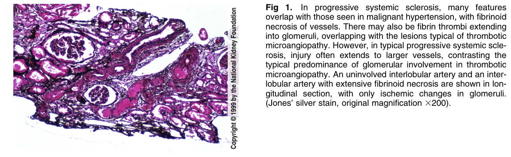
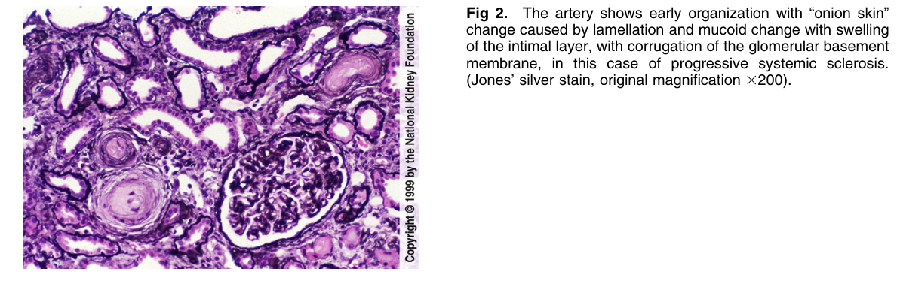
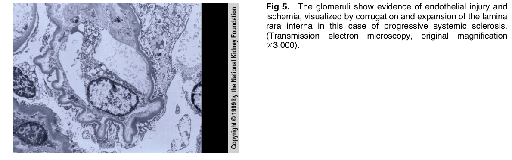

# Progressive Systemic Sclerosis - Figures and Tables Index

This document lists all figures and tables extracted from `Progressive Systemic Sclerosis.pdf`.

## Table of Contents
- [Figures](#figures)
- [Tables](#tables)

---

## Figures

### Fig_1

Figure 1. In progressive systemic sclerosis, many features overlap with those seen in malignant hypertension, with fibrinoid necrosis of vessels. There may also be fibrin thrombi extending into glomeruli, overlapping with the lesions typical of thrombotic microangiopathy. However, in typical progressive systemic sclerosis, injury often extends to larger vessels, contrasting the typical predominance of glomerular involvement in thrombotic microangiopathy. An uninvolved interlobular artery and an interlobular artery with extensive fibrinoid necrosis are shown in longitudinal section, with only ischemic changes in glomeruli. (Jones’ silver stain, original magnification 3200).

---

### Fig_2

Figure 2. The artery shows early organization with “onion skin” change caused by lamellation and mucoid change with swelling of the intimal layer, with corrugation of the glomerular basement membrane, in this case of progressive systemic sclerosis. (Jones’ silver stain, original magnification 3200).

---

### Fig_5

Figure 5. The glomeruli show evidence of endothelial injury and ischemia, visualized by corrugation and expansion of the lamina rara interna in this case of progressive systemic sclerosis. (Transmission electron microscopy, original magnification 33,000).

---

## Tables

*No tables resolved for this chapter.*
