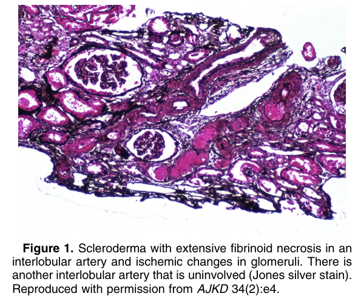
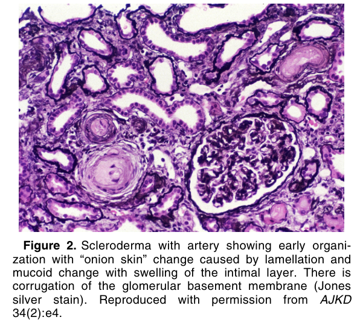
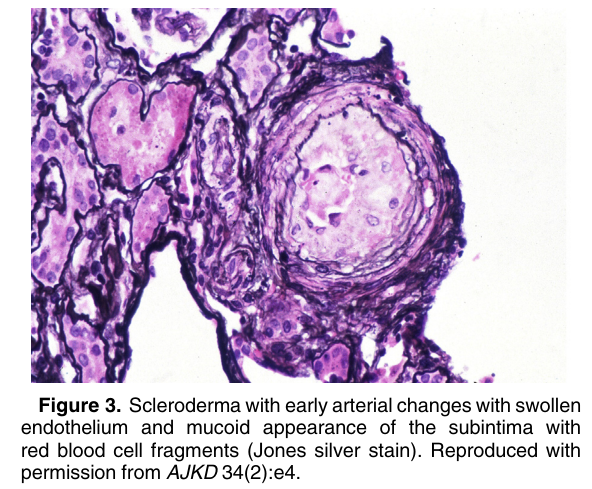
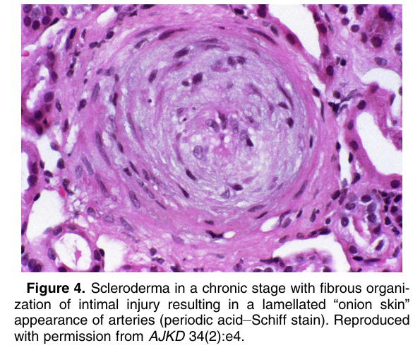
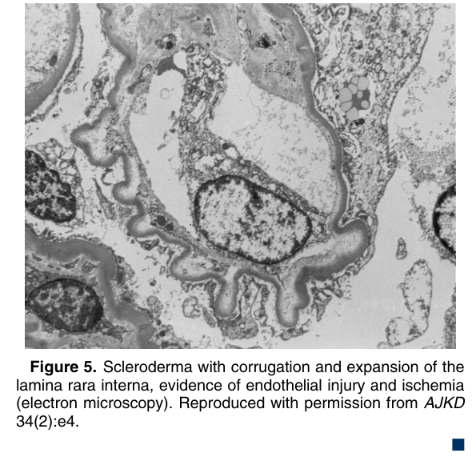

# Systemic Sclerosis - Figures and Tables Index

This document lists all figures and tables extracted from `Systemic Sclerosis.pdf`.

## Table of Contents
- [Figures](#figures)
- [Tables](#tables)

---

## Figures

### Fig_1

Figure 1. Scleroderma with extensive fibrinoid necrosis in an interlobular artery and ischemic changes in glomeruli. There is another interlobular artery that is uninvolved (Jones silver stain). Reproduced with permission from AJKD 34(2):e4.

---

### Fig_2

Figure 2. Scleroderma with artery showing early organization with “onion skin” change caused by lamellation and mucoid change with swelling of the intimal layer. There is corrugation of the glomerular basement membrane (Jones silver stain). Reproduced with permission from AJKD 34(2):e4.

---

### Fig_3

Figure 3. Scleroderma with early arterial changes with swollen endothelium and mucoid appearance of the subintima with red blood cell fragments (Jones silver stain). Reproduced with permission from AJKD 34(2):e4.

---

### Fig_4

Figure 4. Scleroderma in a chronic stage with fibrous organization of intimal injury resulting in a lamellated “onion skin” appearance of arteries (periodic acid–Schiff stain). Reproduced with permission from AJKD 34(2):e4.

---

### Fig_5

Figure 5. Scleroderma with corrugation and expansion of the lamina rara interna, evidence of endothelial injury and ischemia (electron microscopy). Reproduced with permission from AJKD 34(2):e4. -

---

## Tables

*No tables resolved for this chapter.*
