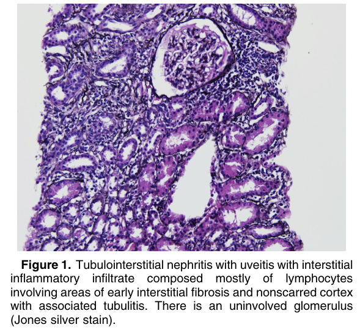
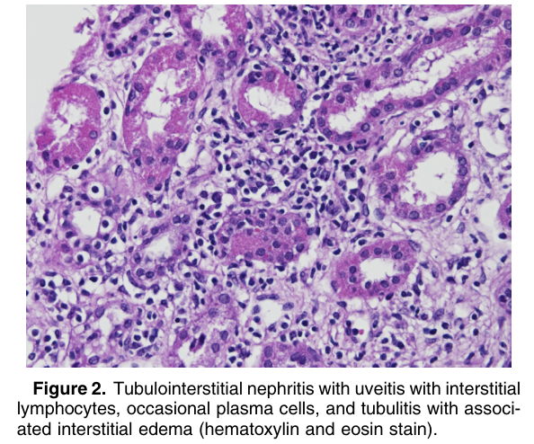
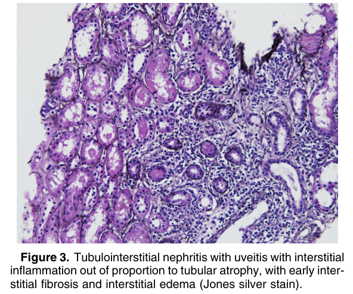

# Tubulointerstitial Nephritis With Uveitis - Figures and Tables Index

This document lists all figures and tables extracted from `Tubulointerstitial Nephritis With Uveitis.pdf`.

## Table of Contents
- [Figures](#figures)
- [Tables](#tables)

---

## Figures

### Fig_1

Figure 1. Tubulointerstitial nephritis with uveitis with interstitial inflammatory infiltrate composed mostly of lymphocytes involving areas of early interstitial fibrosis and nonscarred cortex with associated tubulitis. There is an uninvolved glomerulus (Jones silver stain).

---

### Fig_2

Figure 2. Tubulointerstitial nephritis with uveitis with interstitial lymphocytes, occasional plasma cells, and tubulitis with associated interstitial edema (hematoxylin and eosin stain).

---

### Fig_3

Figure 3. Tubulointerstitial nephritis with uveitis with interstitial inflammation out of proportion to tubular atrophy, with early interstitial fibrosis and interstitial edema (Jones silver stain).

---

## Tables

*No tables resolved for this chapter.*
