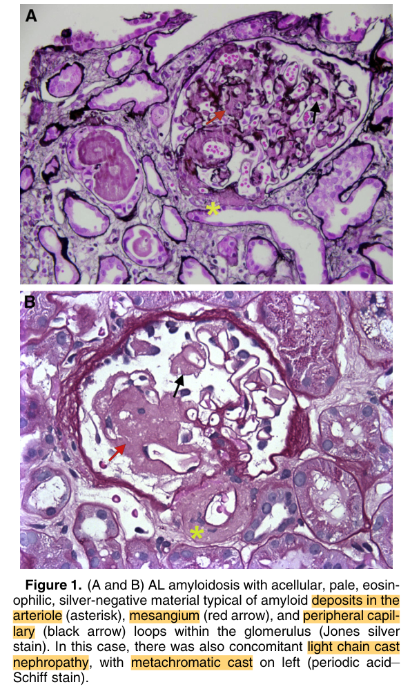
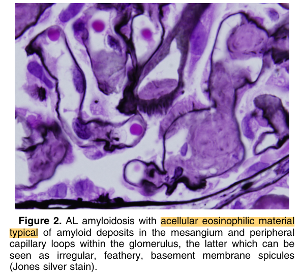
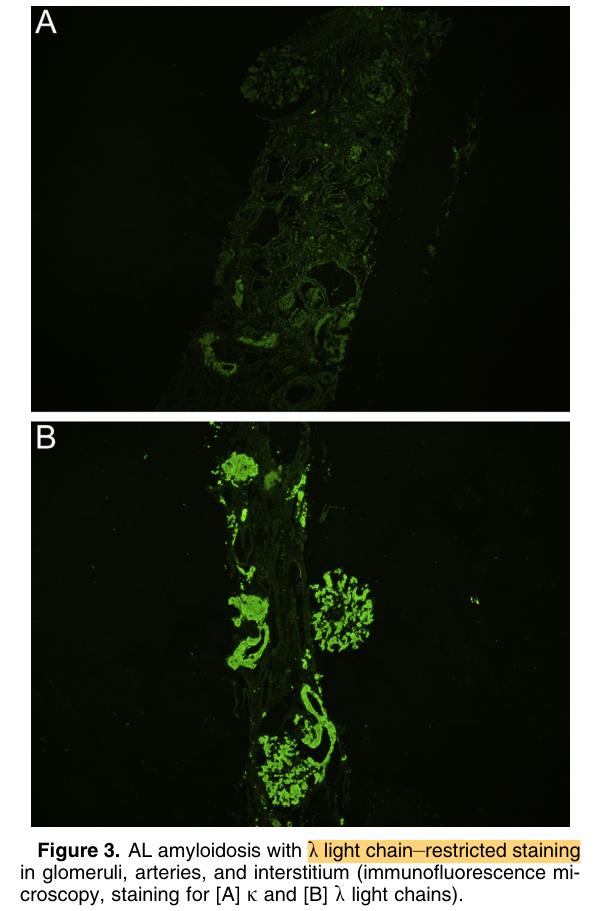
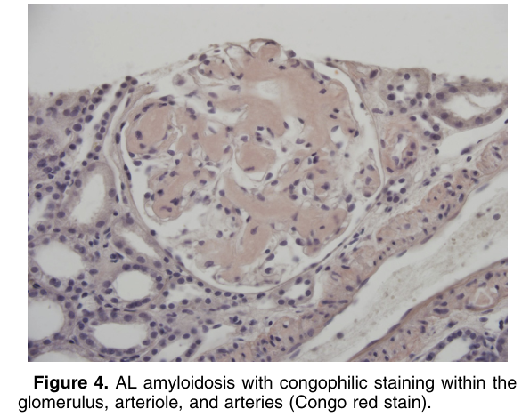
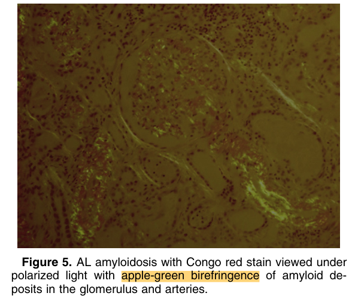
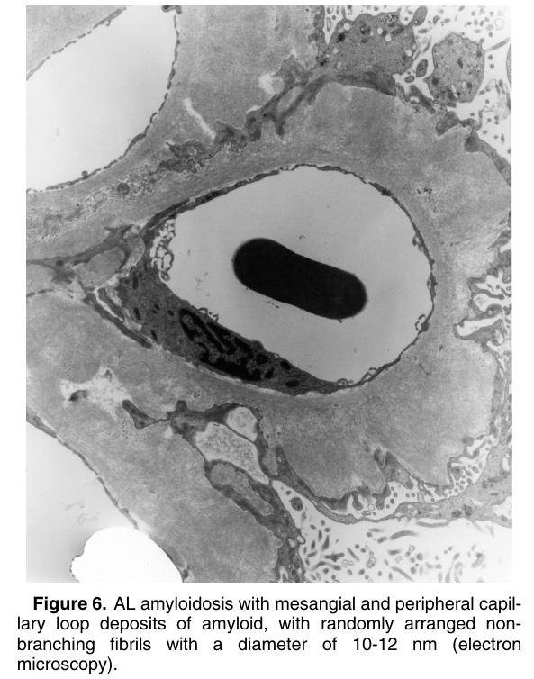
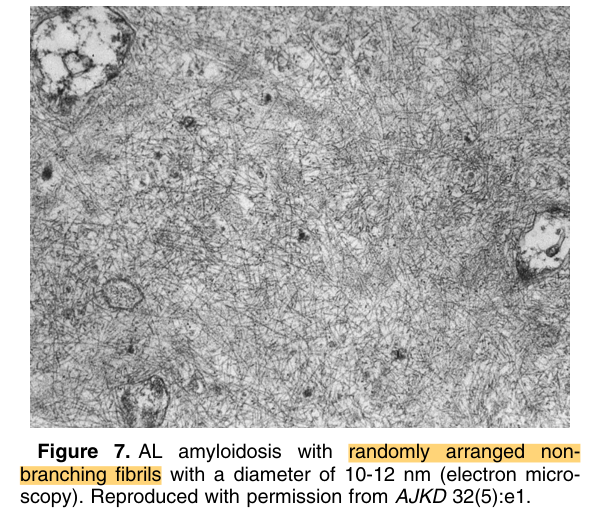

# AL Amyloidosis - Figures and Tables Index

This document lists all figures and tables extracted from `AL Amyloidosis.pdf`.

## Table of Contents
- [Figures](#figures)
- [Tables](#tables)

---

## Figures

### Fig_1

Figure 1. (A and B) AL amyloidosis with acellular, pale, eosinophilic, silver-negative material typical of amyloid deposits in the arteriole (asterisk), mesangium (red arrow), and peripheral capillary (black arrow) loops within the glomerulus (Jones silver stain). In this case, there was also concomitant light chain cast nephropathy, with metachromatic cast on left (periodic acid– Schiff stain).

---

### Fig_2

Figure 2. AL amyloidosis with acellular eosinophilic material typical of amyloid deposits in the mesangium and peripheral capillary loops within the glomerulus, the latter which can be seen as irregular, feathery, basement membrane spicules (Jones silver stain).

---

### Fig_3

Figure 3. AL amyloidosis with l light chain–restricted staining in glomeruli, arteries, and interstitium (immunofluorescence mi croscopy, staining for [A] k and [B] l light chains).

---

### Fig_4

Figure 4. AL amyloidosis with congophilic staining within the glomerulus, arteriole, and arteries (Congo red stain).

---

### Fig_5

Figure 5. AL amyloidosis with Congo red stain viewed under polarized light with apple-green birefringence of amyloid deposits in the glomerulus and arteries.

---

### Fig_6

Figure 6. AL amyloidosis with mesangial and peripheral capillary loop deposits of amyloid, with randomly arranged nonbranching fibrils with a diameter of 10-12 nm (electron microscopy).

---

### Fig_7

Figure 7. AL amyloidosis with randomly arranged non branching fibrils with a diameter of 10-12 nm (electron micro scopy). Reproduced with permission from AJKD 32(5):e1.

---

## Tables

*No tables resolved for this chapter.*
