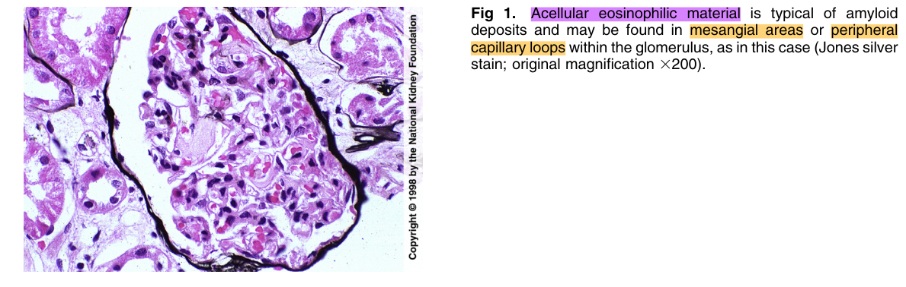
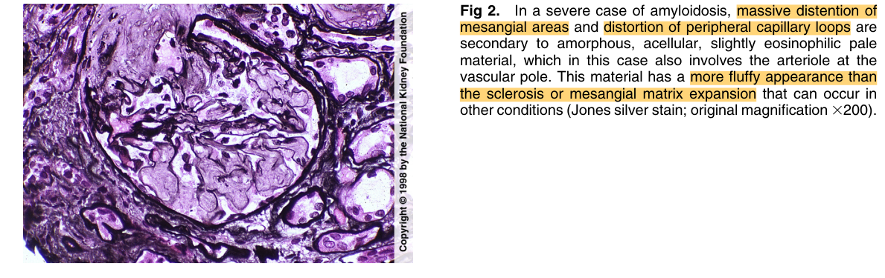
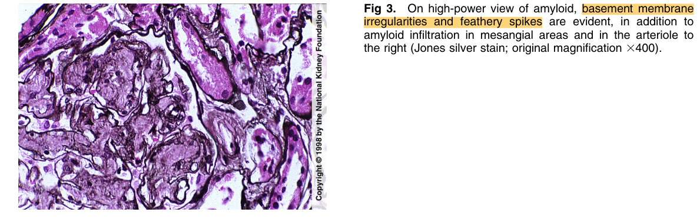
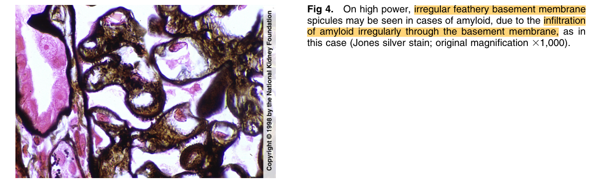
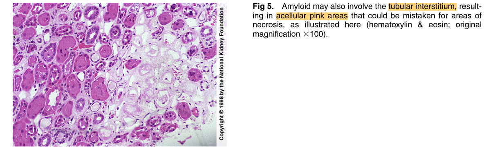
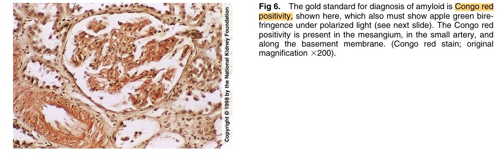
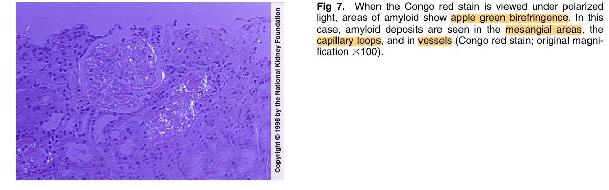
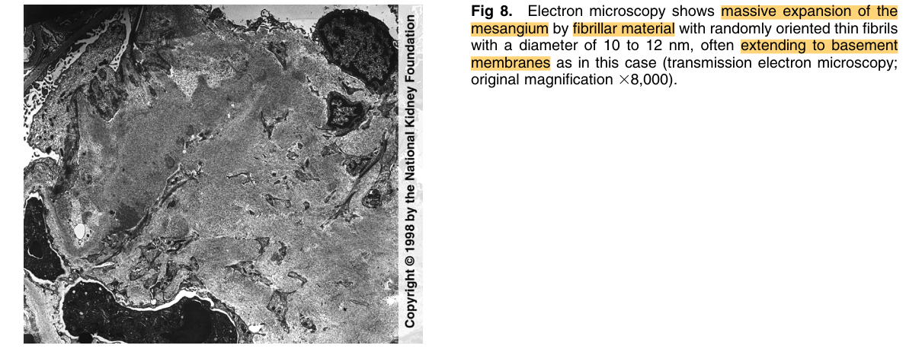
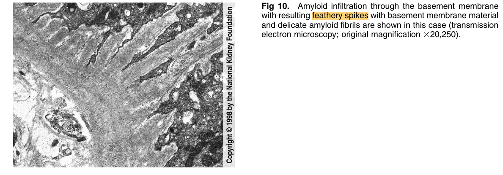

# Amyloid - Figures and Tables Index

This document lists all figures and tables extracted from `Amyloid.pdf`.

## Table of Contents
- [Figures](#figures)
- [Tables](#tables)

---

## Figures

### Fig_1

Figure 1. Acellular eosinophilic material is typical of amyloid deposits and may be found in mesangial areas or periphera capillary loops within the glomerulus, as in this case (Jones silver stain; original magnification 3200).

---

### Fig_2

Figure 2. In a severe case of amyloidosis, massive distention o mesangial areas and distortion of peripheral capillary loops are secondary to amorphous, acellular, slightly eosinophilic pale material, which in this case also involves the arteriole at the vascular pole. This material has a more fluffy appearance than the sclerosis or mesangial matrix expansion that can occur in other conditions (Jones silver stain; original magnification 3200).

---

### Fig_3

Figure 3. On high-power view of amyloid, basement membrane irregularities and feathery spikes are evident, in addition to amyloid infiltration in mesangial areas and in the arteriole to the right (Jones silver stain; original magnification 3400).

---

### Fig_4

Figure 4. On high power, irregular feathery basement membrane spicules may be seen in cases of amyloid, due to the infiltration of amyloid irregularly through the basement membrane, as in this case (Jones silver stain; original magnification 31,000).

---

### Fig_5

Figure 5. Amyloid may also involve the tubular interstitium, resulting in acellular pink areas that could be mistaken for areas of necrosis, as illustrated here (hematoxylin & eosin; origina magnification 3100).

---

### Fig_6

Figure 6. The gold standard for diagnosis of amyloid is Congo red positivity, shown here, which also must show apple green birefringence under polarized light (see next slide). The Congo red positivity is present in the mesangium, in the small artery, and along the basement membrane. (Congo red stain; origina magnification 3200).

---

### Fig_7

Figure 7. When the Congo red stain is viewed under polarized light, areas of amyloid show apple green birefringence. In this case, amyloid deposits are seen in the mesangial areas, the capillary loops, and in vessels (Congo red stain; original magnification 3100)

---

### Fig_8

Figure 8. Electron microscopy shows massive expansion of the mesangium by fibrillar material with randomly oriented thin fibrils with a diameter of 10 to 12 nm, often extending to basemen membranes as in this case (transmission electron microscopy; original magnification 38,000).

---

### Fig_10

Figure 10. Amyloid infiltration through the basement membrane with resulting feathery spikes with basement membrane materia and delicate amyloid fibrils are shown in this case (transmission electron microscopy; original magnification 320,250).

---

## Tables

*No tables resolved for this chapter.*
