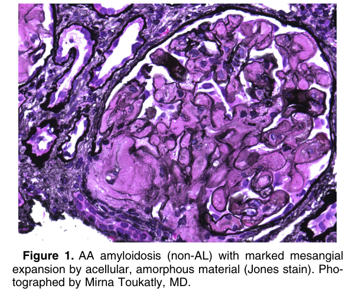
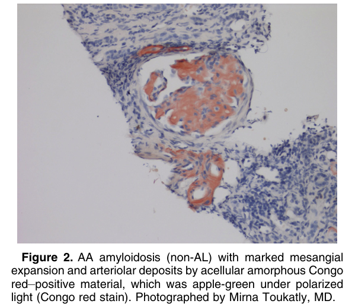
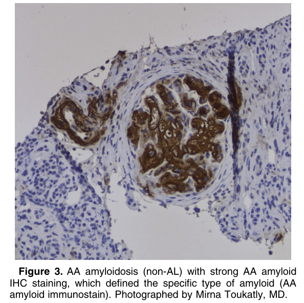
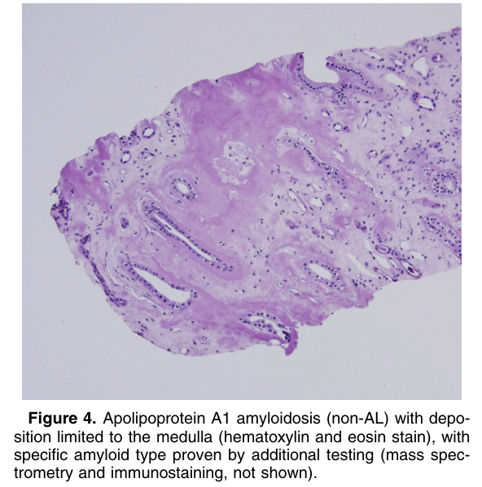
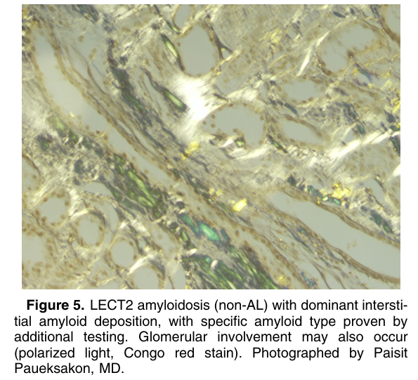
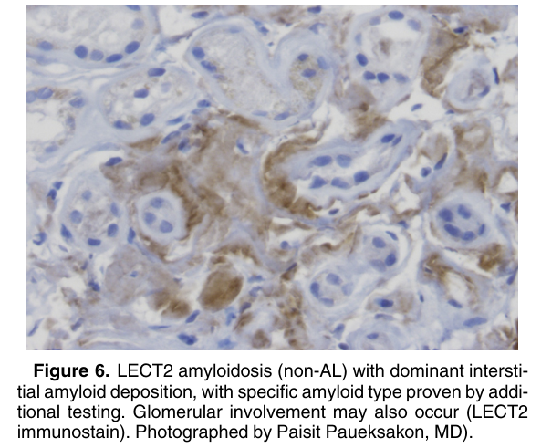
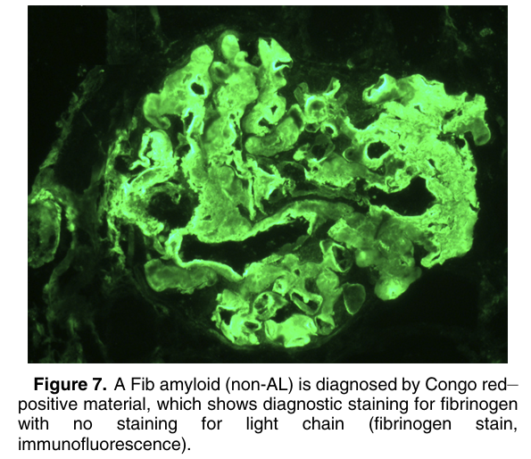

# Hereditary and Other Non-AL Amyloidoses - Figures and Tables Index

This document lists all figures and tables extracted from `Hereditary and Other Non-AL Amyloidoses.pdf`.

## Table of Contents
- [Figures](#figures)
- [Tables](#tables)

---

## Figures

### Fig_1

Figure 1. AA amyloidosis (non-AL) with marked mesangial expansion by acellular, amorphous material (Jones stain). Photographed by Mirna Toukatly, MD.

---

### Fig_2

Figure 2. AA amyloidosis (non-AL) with marked mesangial expansion and arteriolar deposits by acellular amorphous Congo red–positive material, which was apple-green under polarized light (Congo red stain). Photographed by Mirna Toukatly, MD.

---

### Fig_3

Figure 3. AA amyloidosis (non-AL) with strong AA amyloid IHC staining, which defined the specific type of amyloid (AA amyloid immunostain). Photographed by Mirna Toukatly, MD.

---

### Fig_4

Figure 4. Apolipoprotein A1 amyloidosis (non-AL) with deposition limited to the medulla (hematoxylin and eosin stain), with specific amyloid type proven by additional testing (mass spectrometry and immunostaining, not shown).

---

### Fig_5

Figure 5. LECT2 amyloidosis (non-AL) with dominant interstitial amyloid deposition, with specific amyloid type proven by additional testing. Glomerular involvement may also occur (polarized light, Congo red stain). Photographed by Paisit Paueksakon, MD.

---

### Fig_6

Figure 6. LECT2 amyloidosis (non-AL) with dominant interstitial amyloid deposition, with specific amyloid type proven by additional testing. Glomerular involvement may also occur (LECT2 immunostain). Photographed by Paisit Paueksakon, MD).

---

### Fig_7

Figure 7. A Fib amyloid (non-AL) is diagnosed by Congo red– positive material, which shows diagnostic staining for fibrinogen with no staining for light chain (fibrinogen stain, immunofluorescence).

---

## Tables

*No tables resolved for this chapter.*
