# Cryoglobulin-Related Glomerulonephritis - Figures and Tables Index

This document lists all figures and tables extracted from `Cryoglobulin-Related Glomerulonephritis.pdf`.

## Table of Contents
- [Figures](#figures)
- [Tables](#tables)

---

## Figures

### Fig_1

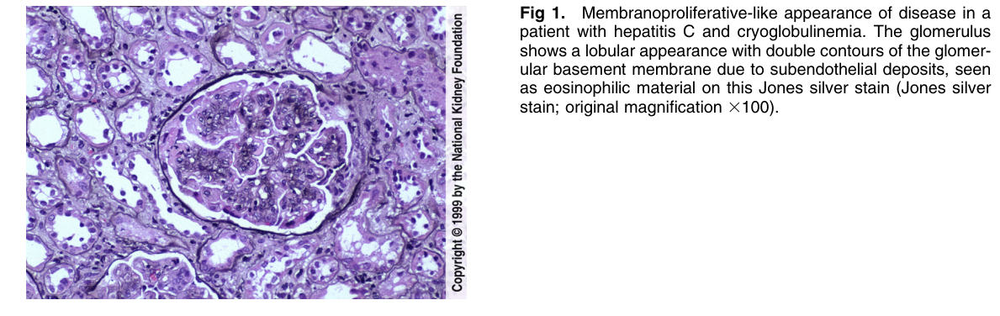

Figure 1. Membranoproliferative-like appearance of disease in a patient with hepatitis C and cryoglobulinemia. The glomerulus shows a lobular appearance with double contours of the glomerular basement membrane due to subendothelial deposits, seen as eosinophilic material on this Jones silver stain (Jones silver stain; original magnification 3100).

---

### Fig_2

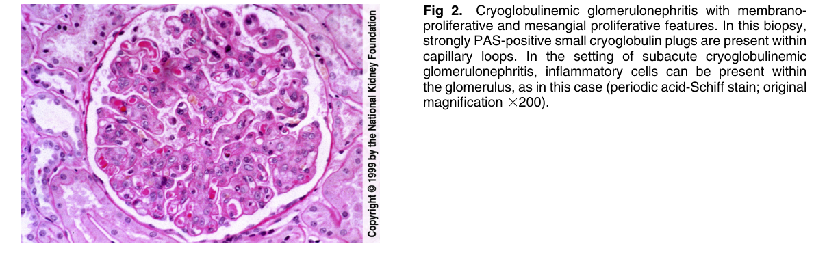

Figure 2. Cryoglobulinemic glomerulonephritis with membranoproliferative and mesangial proliferative features. In this biopsy, strongly PAS-positive small cryoglobulin plugs are present within capillary loops. In the setting of subacute cryoglobulinemic glomerulonephritis, inflammatory cells can be present within the glomerulus, as in this case (periodic acid-Schiff stain; origina magnification 3200).

---

### Fig_3

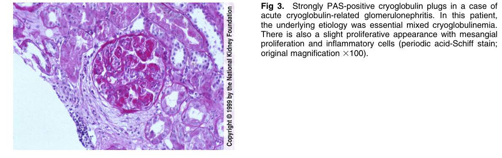

Figure 3. Strongly PAS-positive cryoglobulin plugs in a case o acute cryoglobulin-related glomerulonephritis. In this patient, the underlying etiology was essential mixed cryoglobulinemia. There is also a slight proliferative appearance with mesangia proliferation and inflammatory cells (periodic acid-Schiff stain; original magnification 3100).

---

### Fig_4

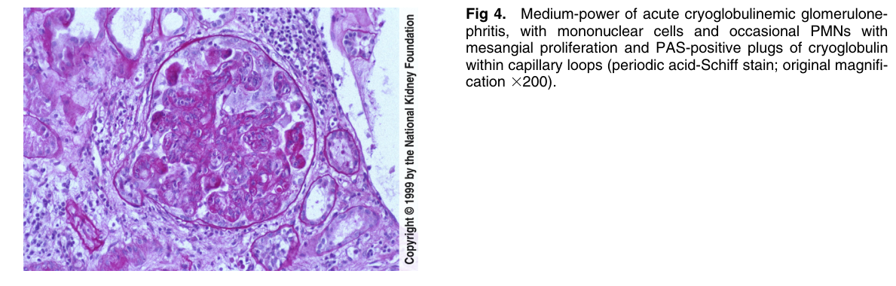

Figure 4. Medium-power of acute cryoglobulinemic glomerulonephritis, with mononuclear cells and occasional PMNs with mesangial proliferation and PAS-positive plugs of cryoglobulin within capillary loops (periodic acid-Schiff stain; original magnifi cation 3200).

---

### Fig_5

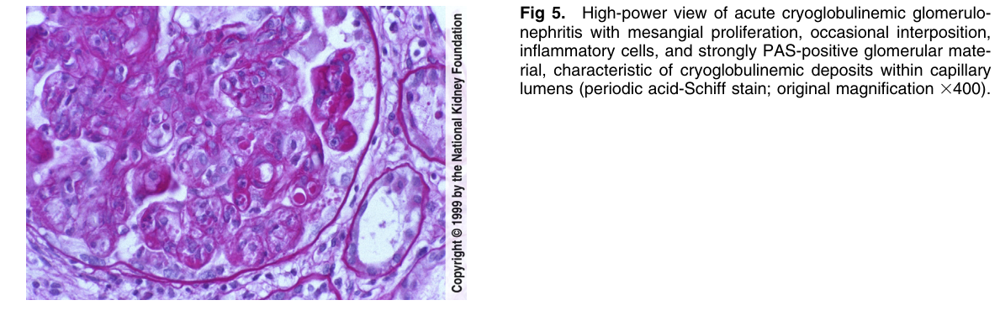

Figure 5. High-power view of acute cryoglobulinemic glomerulonephritis with mesangial proliferation, occasional interposition, inflammatory cells, and strongly PAS-positive glomerular mate rial, characteristic of cryoglobulinemic deposits within capillary lumens (periodic acid-Schiff stain; original magnification 3400).

---

### Fig_6

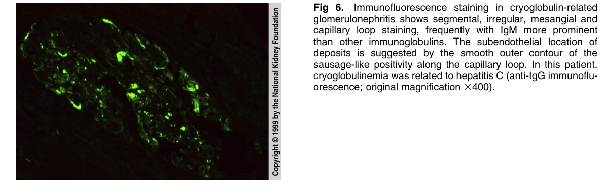

Figure 6. Immunofluorescence staining in cryoglobulin-related glomerulonephritis shows segmental, irregular, mesangial and capillary loop staining, frequently with IgM more prominent than other immunoglobulins. The subendothelial location of deposits is suggested by the smooth outer contour of the sausage-like positivity along the capillary loop. In this patient, cryoglobulinemia was related to hepatitis C (anti-IgG immunofluorescence; original magnification 3400).

---

### Fig_7

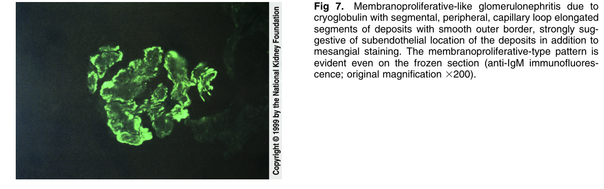

Figure 7. Membranoproliferative-like glomerulonephritis due to cryoglobulin with segmental, peripheral, capillary loop elongated segments of deposits with smooth outer border, strongly suggestive of subendothelial location of the deposits in addition to mesangial staining. The membranoproliferative-type pattern is evident even on the frozen section (anti-IgM immunofluorescence; original magnification 3200).

---

### Fig_8

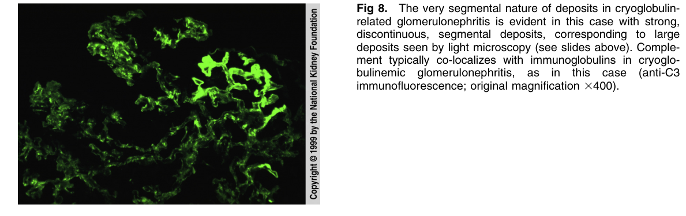

Figure 8. The very segmental nature of deposits in cryoglobulin related glomerulonephritis is evident in this case with strong, discontinuous, segmental deposits, corresponding to large deposits seen by light microscopy (see slides above). Complement typically co-localizes with immunoglobulins in cryoglo bulinemic glomerulonephritis, as in this case (anti-C3 immunofluorescence; original magnification 3400).

---

### Fig_9

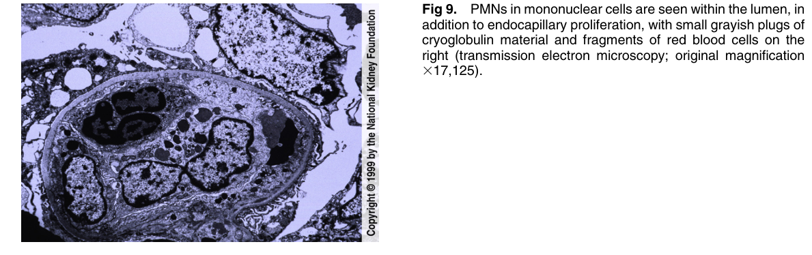

Figure 9. PMNs in mononuclear cells are seen within the lumen, in addition to endocapillary proliferation, with small grayish plugs o cryoglobulin material and fragments of red blood cells on the right (transmission electron microscopy; original magnification 317,125).

---

### Fig_10

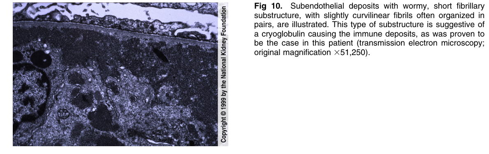

Figure 10. Subendothelial deposits with wormy, short fibrillar substructure, with slightly curvilinear fibrils often organized in pairs, are illustrated. This type of substructure is suggestive o a cryoglobulin causing the immune deposits, as was proven to be the case in this patient (transmission electron microscopy; original magnification 351,250).

---

### Fig_11

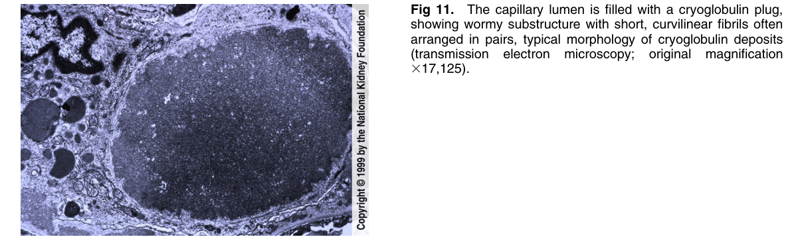

Figure 11. The capillary lumen is filled with a cryoglobulin plug, showing wormy substructure with short, curvilinear fibrils often arranged in pairs, typical morphology of cryoglobulin deposits (transmission electron microscopy; original magnification 317,125).

---

### Fig_12

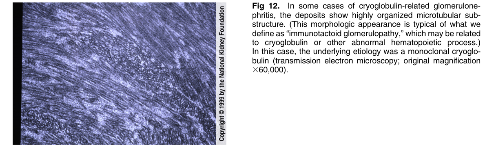

Figure 12. In some cases of cryoglobulin-related glomerulonephritis, the deposits show highly organized microtubular substructure. (This morphologic appearance is typical of what we define as “immunotactoid glomerulopathy,” which may be related to cryoglobulin or other abnormal hematopoietic process.) In this case, the underlying etiology was a monoclonal cryoglobulin (transmission electron microscopy; original magnification 360,000).

---

## Tables

*No tables resolved for this chapter.*
