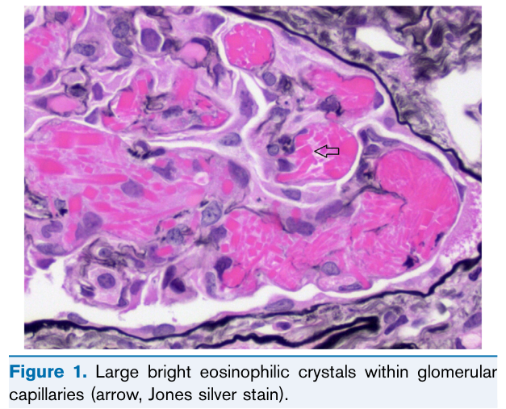
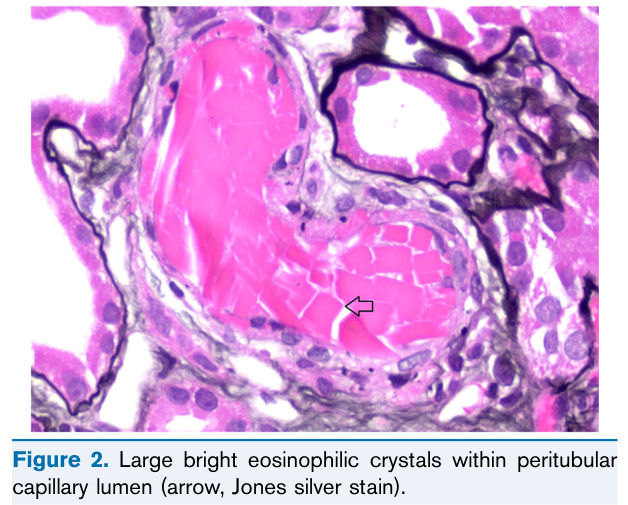
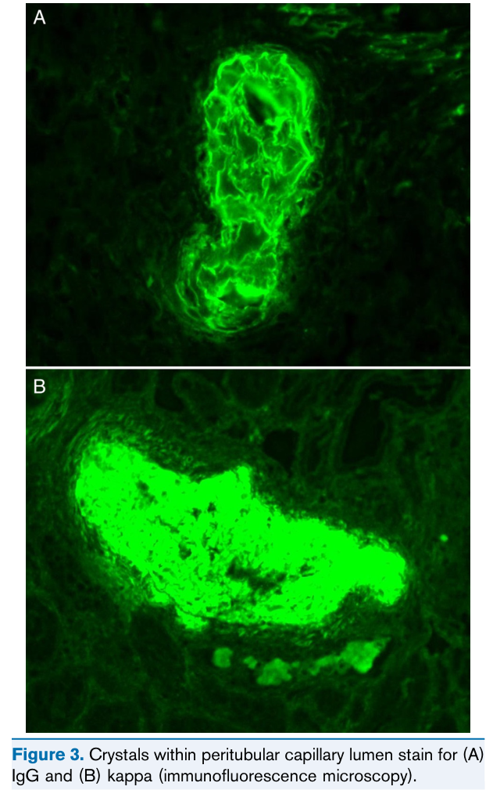
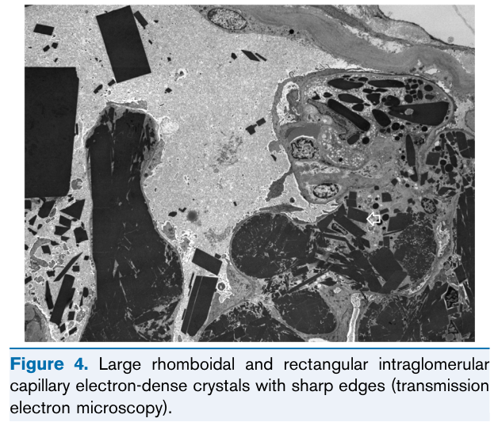
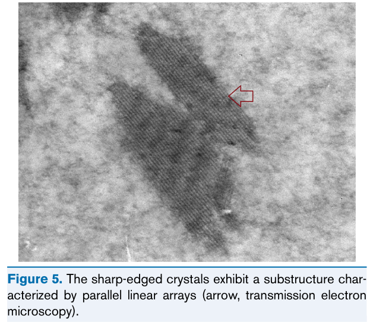

# Crystalglobulin-Induced Nephropathy - Figures and Tables Index

This document lists all figures and tables extracted from `Crystalglobulin-Induced Nephropathy.pdf`.

## Table of Contents
- [Figures](#figures)
- [Tables](#tables)

---

## Figures

### Fig_1

Figure 1. Large bright eosinophilic crystals within glomerular capillaries (arrow, Jones silver stain).

---

### Fig_2

Figure 2. Large bright eosinophilic crystals within peritubular capillary lumen (arrow, Jones silver stain).

---

### Fig_3

Figure 3. Crystals within peritubular capillary lumen stain for (A) IgG and (B) kappa (immunofluorescence microscopy).

---

### Fig_4

Figure 4. Large rhomboidal and rectangular intraglomerular capillary electron-dense crystals with sharp edges (transmission electron microscopy).

---

### Fig_5

Figure 5. The sharp-edged crystals exhibit a substructure char acterized by parallel linear arrays (arrow, transmission electron microscopy).

---

## Tables

*No tables resolved for this chapter.*
