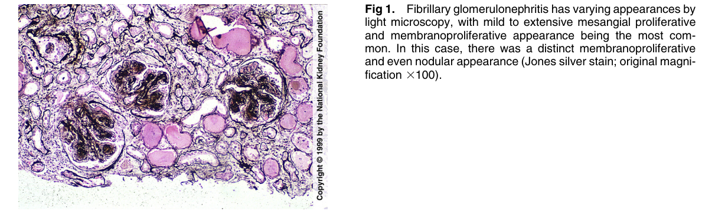
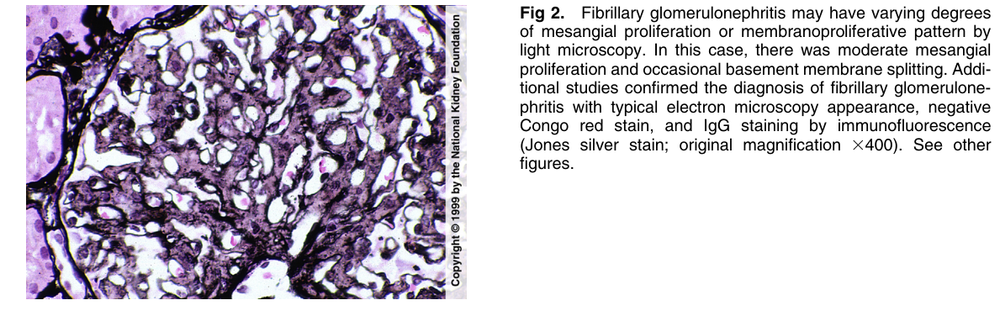
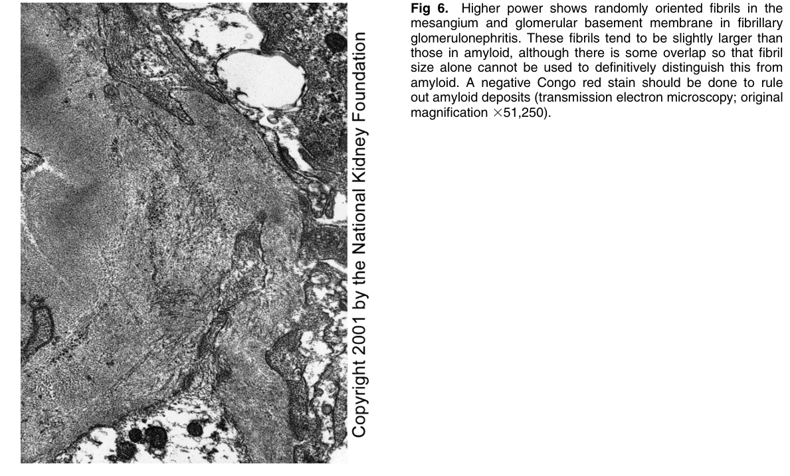
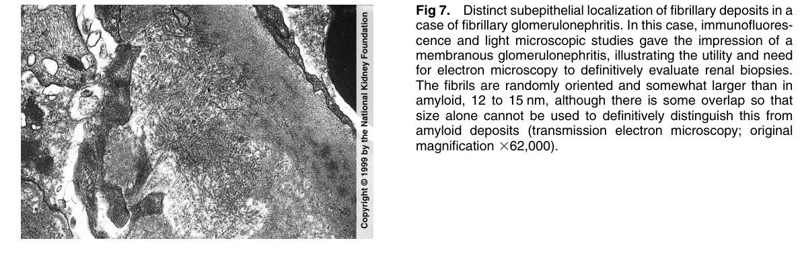
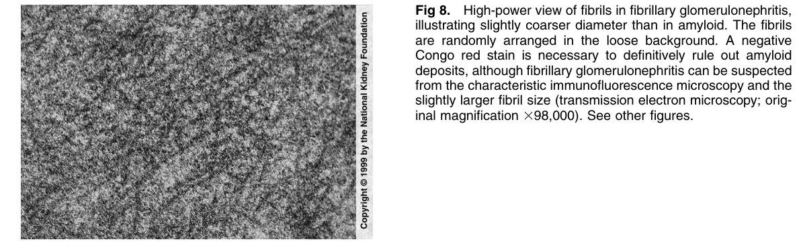

# Fibrillary Glomerulonephritis 2 - Figures and Tables Index

This document lists all figures and tables extracted from `Fibrillary Glomerulonephritis 2.pdf`.

## Table of Contents
- [Figures](#figures)
- [Tables](#tables)

---

## Figures

### Fig_1

Figure 1. Fibrillary glomerulonephritis has varying appearances by light microscopy, with mild to extensive mesangial proliferative and membranoproliferative appearance being the most common. In this case, there was a distinct membranoproliferative and even nodular appearance (Jones silver stain; original magnification 3100)

---

### Fig_2

Figure 2. Fibrillary glomerulonephritis may have varying degrees of mesangial proliferation or membranoproliferative pattern by light microscopy. In this case, there was moderate mesangia proliferation and occasional basement membrane splitting. Additional studies confirmed the diagnosis of fibrillary glomerulonephritis with typical electron microscopy appearance, negative Congo red stain, and IgG staining by immunofluorescence (Jones silver stain; original magnification 3400). See other figures.

---

### Fig_6

Fig 6. Higher power shows randomly oriented fibrils in the mesangium and glomerular basement membrane in fibrillary glomerulonephritis. These fibrils tend to be slightly larger than those in amyloid, although there is some overlap so that fibril size alone cannot be used to definitively distinguish this from amyloid. A negative Congo red stain should be done to rule out amyloid deposits (transmission electron microscopy; original magnification 351,250).

---

### Fig_7

Figure 7. Distinct subepithelial localization of fibrillary deposits in a case of fibrillary glomerulonephritis. In this case, immunofluorescence and light microscopic studies gave the impression of a membranous glomerulonephritis, illustrating the utility and need for electron microscopy to definitively evaluate renal biopsies. The fibrils are randomly oriented and somewhat larger than in amyloid, 12 to 15 nm, although there is some overlap so that size alone cannot be used to definitively distinguish this from amyloid deposits (transmission electron microscopy; origina magnification 362,000).

---

### Fig_8

Figure 8. High-power view of fibrils in fibrillary glomerulonephritis, illustrating slightly coarser diameter than in amyloid. The fibrils are randomly arranged in the loose background. A negative Congo red stain is necessary to definitively rule out amyloid deposits, although fibrillary glomerulonephritis can be suspected from the characteristic immunofluorescence microscopy and the slightly larger fibril size (transmission electron microscopy; orig inal magnification 398,000). See other figures.

---

## Tables

*No tables resolved for this chapter.*
