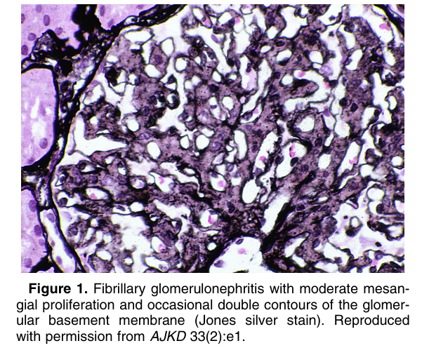
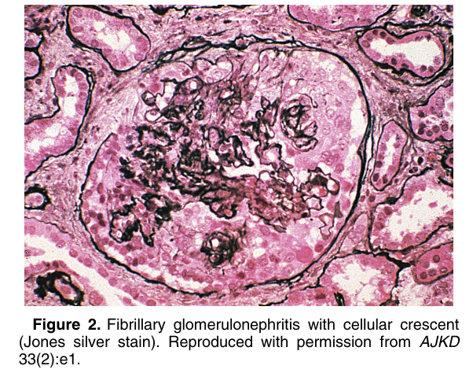
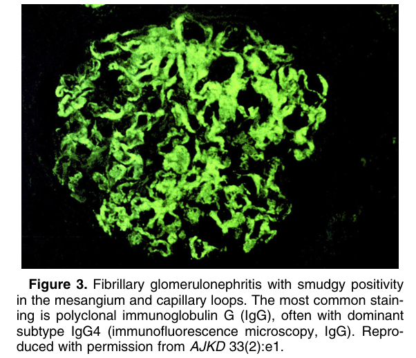
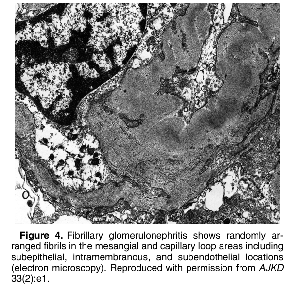
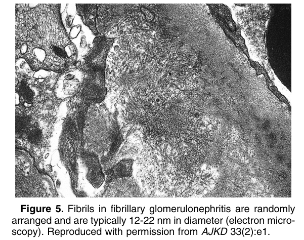

# Fibrillary Glomerulonephritis - Figures and Tables Index

This document lists all figures and tables extracted from `Fibrillary Glomerulonephritis.pdf`.

## Table of Contents
- [Figures](#figures)
- [Tables](#tables)

---

## Figures

### Fig_1

Figure 1. Fibrillary glomerulonephritis with moderate mesangial proliferation and occasional double contours of the glomerular basement membrane (Jones silver stain). Reproduced with permission from AJKD 33(2):e1.

---

### Fig_2

Figure 2. Fibrillary glomerulonephritis with cellular crescent (Jones silver stain). Reproduced with permission from AJKD 33(2):e1.

---

### Fig_3

Figure 3. Fibrillary glomerulonephritis with smudgy positivity in the mesangium and capillary loops. The most common staining is polyclonal immunoglobulin G (IgG), often with dominant subtype IgG4 (immunofluorescence microscopy, IgG). Reproduced with permission from AJKD 33(2):e1.

---

### Fig_4

Figure 4. Fibrillary glomerulonephritis shows randomly arranged fibrils in the mesangial and capillary loop areas including subepithelial, intramembranous, and subendothelial locations (electron microscopy). Reproduced with permission from AJKD 33(2):e1.

---

### Fig_5

Figure 5. Fibrils in fibrillary glomerulonephritis are randomly arranged and are typically 12-22 nm in diameter (electron microscopy). Reproduced with permission from AJKD 33(2):e1.

---

## Tables

*No tables resolved for this chapter.*
