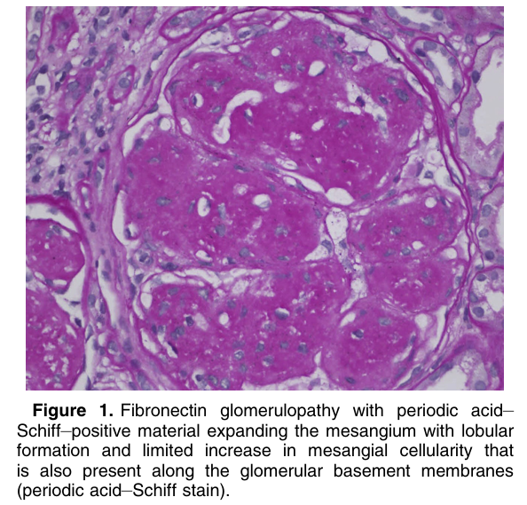
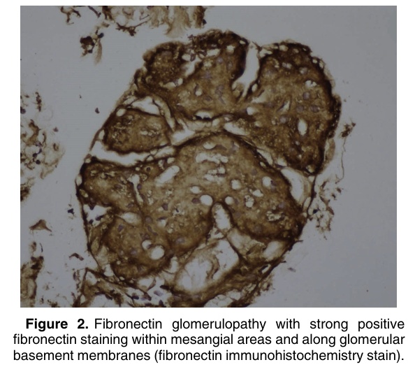
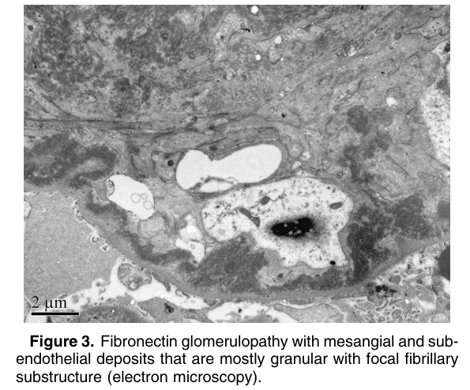
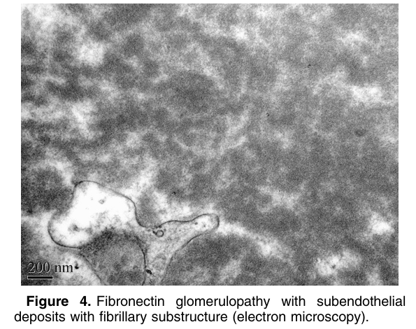

# Fibronectin Glomerulopathy - Figures and Tables Index

This document lists all figures and tables extracted from `Fibronectin Glomerulopathy.pdf`.

## Table of Contents
- [Figures](#figures)
- [Tables](#tables)

---

## Figures

### Fig_1

Figure 1. Fibronectin glomerulopathy with periodic acid– Schiff–positive material expanding the mesangium with lobular formation and limited increase in mesangial cellularity that is also present along the glomerular basement membranes (periodic acid–Schiff stain).

---

### Fig_2

Figure 2. Fibronectin glomerulopathy with strong positive fibronectin staining within mesangial areas and along glomerular basement membranes (fibronectin immunohistochemistry stain).

---

### Fig_3

Figure 3. Fibronectin glomerulopathy with mesangial and subendothelial deposits that are mostly granular with focal fibrillary substructure (electron microscopy).

---

### Fig_4

Figure 4. Fibronectin glomerulopathy with subendothelial deposits with fibrillary substructure (electron microscopy).

---

## Tables

*No tables resolved for this chapter.*
