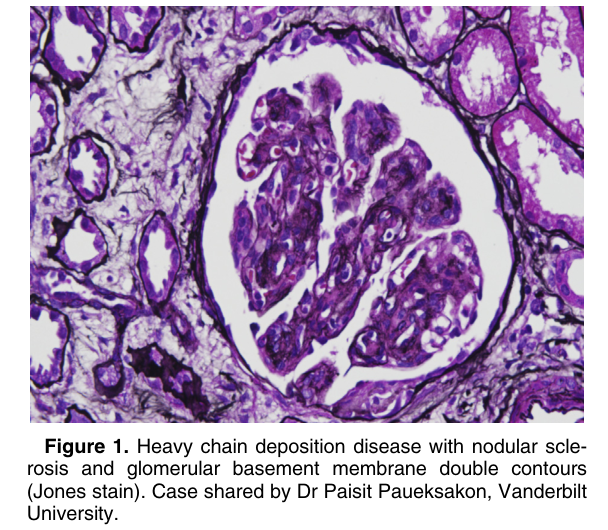
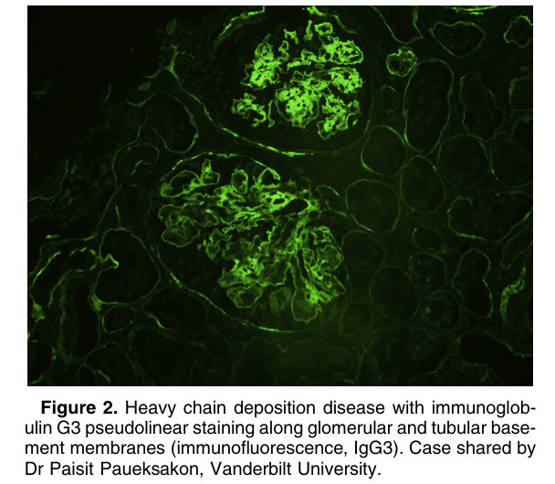
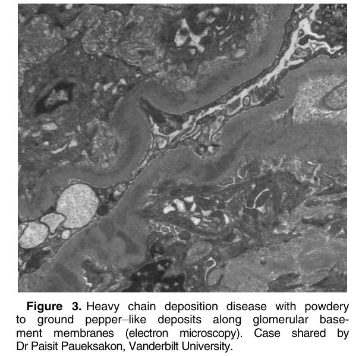
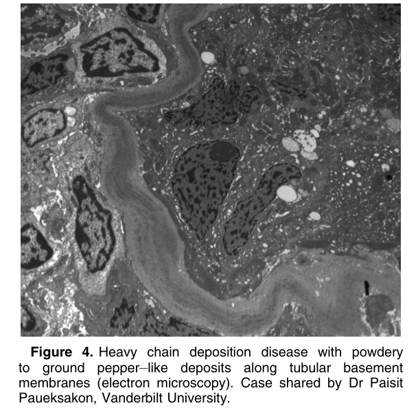

# Heavy Chain Deposition Disease - Figures and Tables Index

This document lists all figures and tables extracted from `Heavy Chain Deposition Disease.pdf`.

## Table of Contents
- [Figures](#figures)
- [Tables](#tables)

---

## Figures

### Fig_1

Figure 1. Heavy chain deposition disease with nodular sclerosis and glomerular basement membrane double contours (Jones stain). Case shared by Dr Paisit Paueksakon, Vanderbilt University.

---

### Fig_2

Figure 2. Heavy chain deposition disease with immunoglobulin G3 pseudolinear staining along glomerular and tubular basement membranes (immunofluorescence, IgG3). Case shared by Dr Paisit Paueksakon, Vanderbilt University.

---

### Fig_3

Figure 3. Heavy chain deposition disease with powdery to ground pepper–like deposits along glomerular basement membranes (electron microscopy). Case shared by Dr Paisit Paueksakon, Vanderbilt University.

---

### Fig_4

Figure 4. Heavy chain deposition disease with powdery to ground pepper–like deposits along tubular basement membranes (electron microscopy). Case shared by Dr Paisit Paueksakon, Vanderbilt University.

---

## Tables

*No tables resolved for this chapter.*
