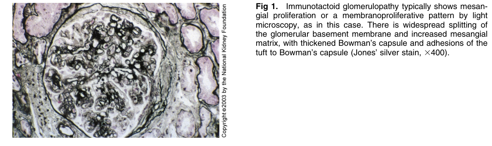
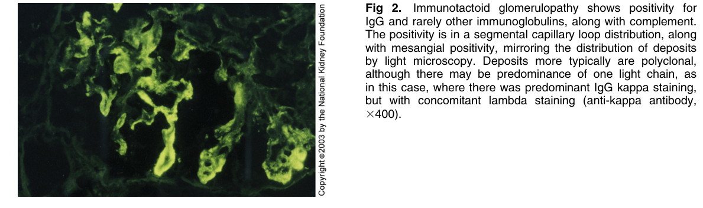
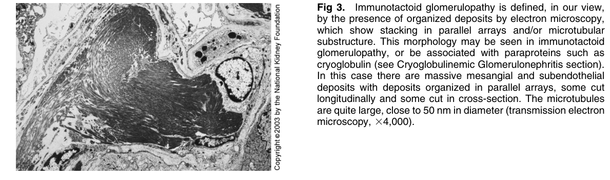
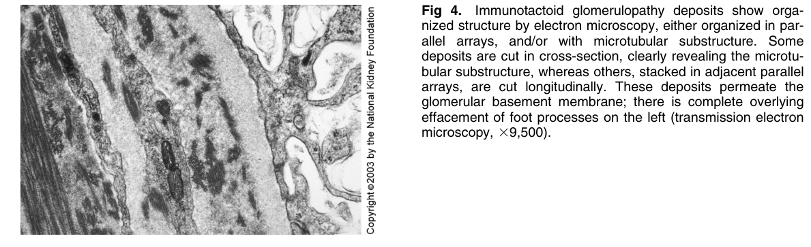

# Immunotactoid Glomerulopathy 2 - Figures and Tables Index

This document lists all figures and tables extracted from `Immunotactoid Glomerulopathy 2.pdf`.

## Table of Contents
- [Figures](#figures)
- [Tables](#tables)

---

## Figures

### Fig_1

Figure 1. Immunotactoid glomerulopathy typically shows mesangial proliferation or a membranoproliferative pattern by light microscopy, as in this case. There is widespread splitting of the glomerular basement membrane and increased mesangia matrix, with thickened Bowman’s capsule and adhesions of the tuft to Bowman’s capsule (Jones’ silver stain, 3400).

---

### Fig_2

Figure 2. Immunotactoid glomerulopathy shows positivity for IgG and rarely other immunoglobulins, along with complement. The positivity is in a segmental capillary loop distribution, along with mesangial positivity, mirroring the distribution of deposit by light microscopy. Deposits more typically are polyclonal, although there may be predominance of one light chain, as in this case, where there was predominant IgG kappa staining, but with concomitant lambda staining (anti-kappa antibody, 3400).

---

### Fig_3

Figure 3. Immunotactoid glomerulopathy is defined, in our view, by the presence of organized deposits by electron microscopy, which show stacking in parallel arrays and/or microtubular substructure. This morphology may be seen in immunotactoid glomerulopathy, or be associated with paraproteins such as cryoglobulin (see Cryoglobulinemic Glomerulonephritis section). In this case there are massive mesangial and subendothelia deposits with deposits organized in parallel arrays, some cut longitudinally and some cut in cross-section. The microtubules are quite large, close to 50 nm in diameter (transmission electron microscopy, 34,000).

---

### Fig_4

Figure 4. Immunotactoid glomerulopathy deposits show organized structure by electron microscopy, either organized in parallel arrays, and/or with microtubular substructure. Some deposits are cut in cross-section, clearly revealing the microtubular substructure, whereas others, stacked in adjacent paralle arrays, are cut longitudinally. These deposits permeate the glomerular basement membrane; there is complete overlying effacement of foot processes on the left (transmission electron microscopy, 39,500).

---

## Tables

*No tables resolved for this chapter.*
