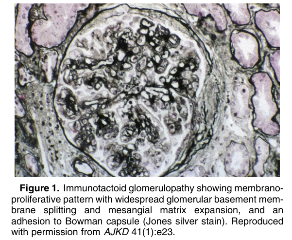
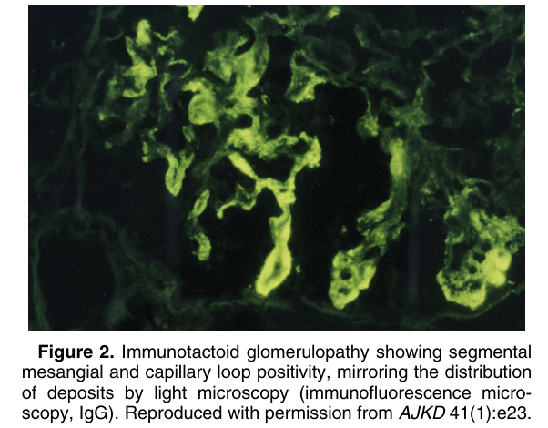
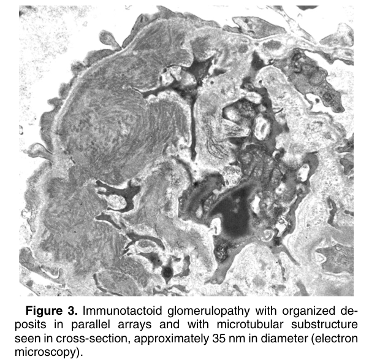
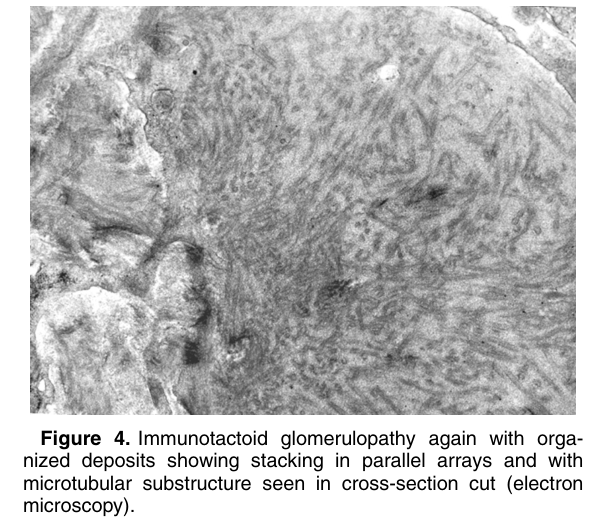

# Immunotactoid Glomerulopathy - Figures and Tables Index

This document lists all figures and tables extracted from `Immunotactoid Glomerulopathy.pdf`.

## Table of Contents
- [Figures](#figures)
- [Tables](#tables)

---

## Figures

### Fig_1

Figure 1. Immunotactoid glomerulopathy showing membranoproliferative pattern with widespread glomerular basement membrane splitting and mesangial matrix expansion, and an adhesion to Bowman capsule (Jones silver stain). Reproduced with permission from AJKD 41(1):e23.

---

### Fig_2

Figure 2. Immunotactoid glomerulopathy showing segmental mesangial and capillary loop positivity, mirroring the distribution of deposits by light microscopy (immunofluorescence microscopy, IgG). Reproduced with permission from AJKD 41(1):e23.

---

### Fig_3

Figure 3. Immunotactoid glomerulopathy with organized deposits in parallel arrays and with microtubular substructure seen in cross-section, approximately 35 nm in diameter (electron microscopy).

---

### Fig_4

Figure 4. Immunotactoid glomerulopathy again with organized deposits showing stacking in parallel arrays and with microtubular substructure seen in cross-section cut (electron microscopy).

---

## Tables

*No tables resolved for this chapter.*
