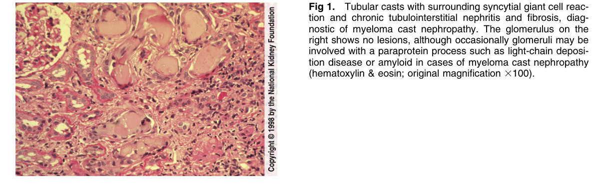
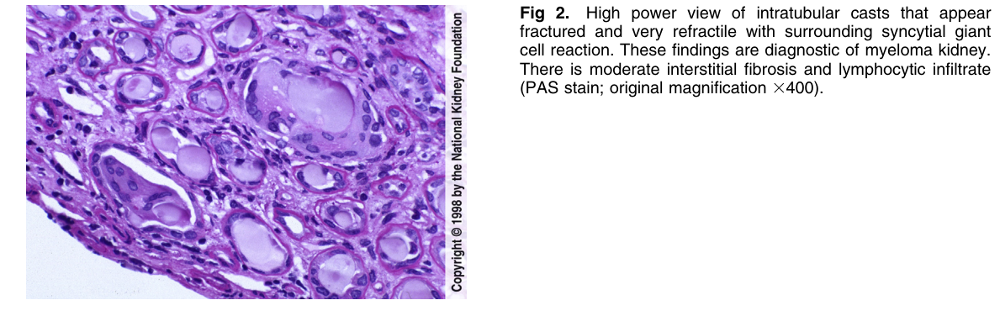
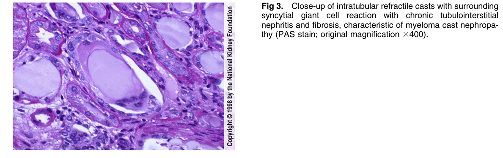
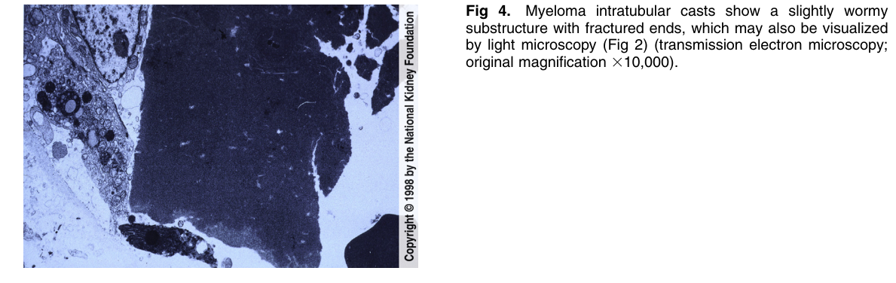

# Light Chain Cast Nephropathy 2 - Figures and Tables Index

This document lists all figures and tables extracted from `Light Chain Cast Nephropathy 2.pdf`.

## Table of Contents
- [Figures](#figures)
- [Tables](#tables)

---

## Figures

### Fig_1

Figure 1. Tubular casts with surrounding syncytial giant cell reaction and chronic tubulointerstitial nephritis and fibrosis, diagnostic of myeloma cast nephropathy. The glomerulus on the right shows no lesions, although occasionally glomeruli may be involved with a paraprotein process such as light-chain deposition disease or amyloid in cases of myeloma cast nephropathy (hematoxylin & eosin; original magnification 3100).

---

### Fig_2

Figure 2. High power view of intratubular casts that appear fractured and very refractile with surrounding syncytial gian cell reaction. These findings are diagnostic of myeloma kidney. There is moderate interstitial fibrosis and lymphocytic infiltrate (PAS stain; original magnification 3400).

---

### Fig_3

Figure 3. Close-up of intratubular refractile casts with surrounding syncytial giant cell reaction with chronic tubulointerstitia nephritis and fibrosis, characteristic of myeloma cast nephropa thy (PAS stain; original magnification 3400).

---

### Fig_4

Figure 4. Myeloma intratubular casts show a slightly wormy substructure with fractured ends, which may also be visualized by light microscopy (Fig 2) (transmission electron microscopy; original magnification 310,000).

---

## Tables

*No tables resolved for this chapter.*
