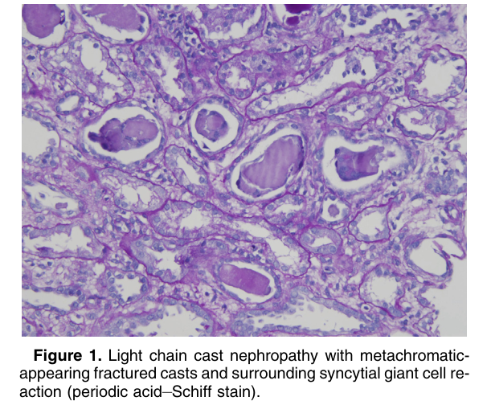
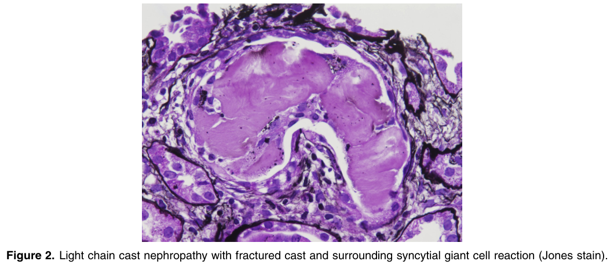
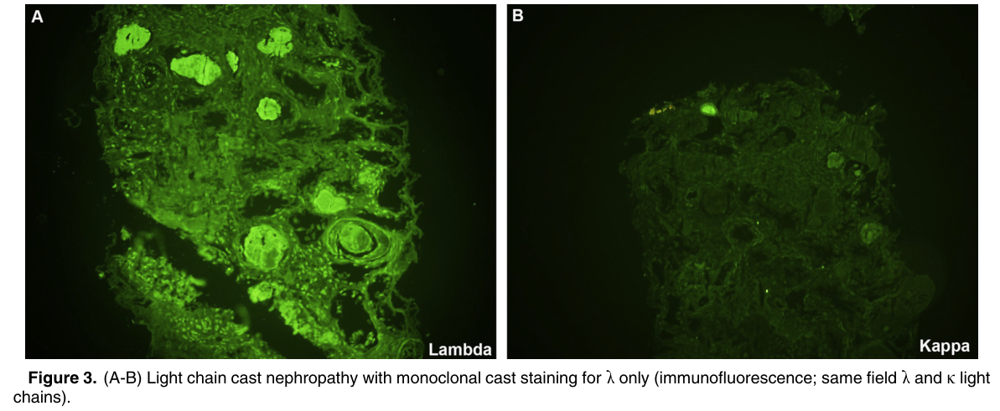

# Light Chain Cast Nephropathy - Figures and Tables Index

This document lists all figures and tables extracted from `Light Chain Cast Nephropathy.pdf`.

## Table of Contents
- [Figures](#figures)
- [Tables](#tables)

---

## Figures

### Fig_1

Figure 1. Light chain cast nephropathy with metachromatic appearing fractured casts and surrounding syncytial giant cell re action (periodic acid–Schiff stain).

---

### Fig_2

Figure 2. Light chain cast nephropathy with fractured cast and surrounding syncytial giant cell reaction (Jones stain).

---

### Fig_3

Figure 3. (A-B) Light chain cast nephropathy with monoclonal cast staining for l only (immunofluorescence; same field l and k light chains).

---

## Tables

*No tables resolved for this chapter.*
