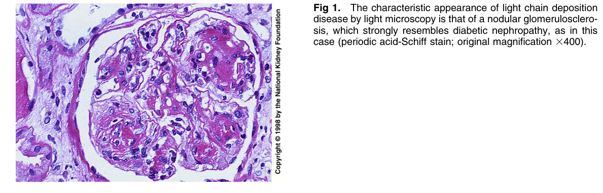
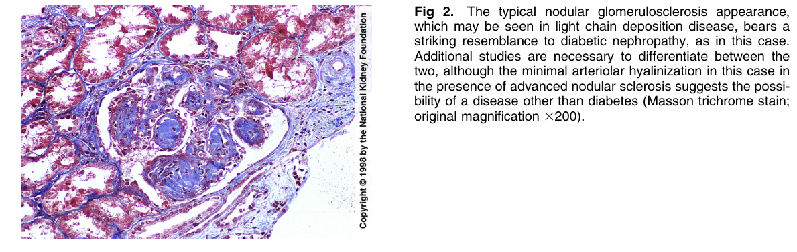
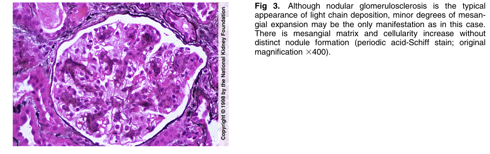
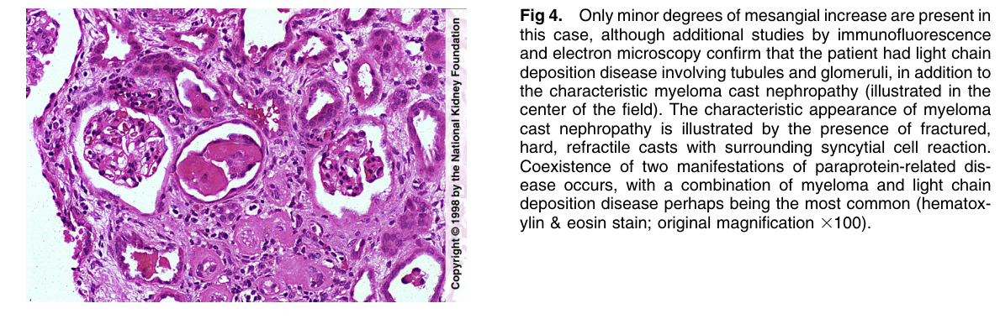
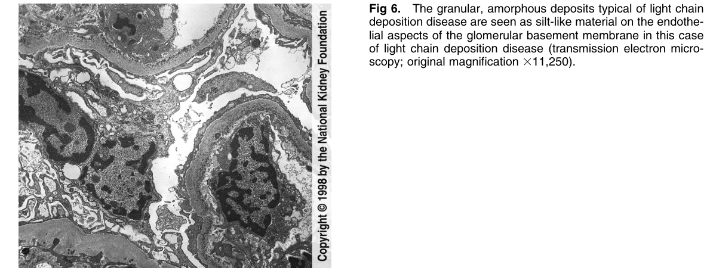
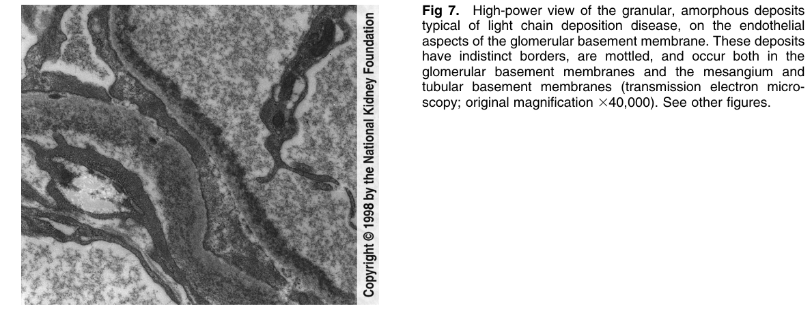
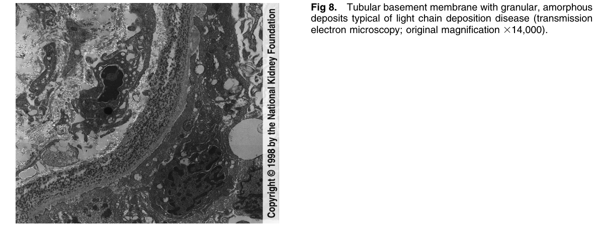

# Light Chain Deposition Disease 2 - Figures and Tables Index

This document lists all figures and tables extracted from `Light Chain Deposition Disease 2.pdf`.

## Table of Contents
- [Figures](#figures)
- [Tables](#tables)

---

## Figures

### Fig_1

Figure 1. The characteristic appearance of light chain deposition disease by light microscopy is that of a nodular glomerulosclerosis, which strongly resembles diabetic nephropathy, as in this case (periodic acid-Schiff stain; original magnification 3400)

---

### Fig_2

Figure 2. The typical nodular glomerulosclerosis appearance, which may be seen in light chain deposition disease, bears a striking resemblance to diabetic nephropathy, as in this case. Additional studies are necessary to differentiate between the two, although the minimal arteriolar hyalinization in this case in the presence of advanced nodular sclerosis suggests the possibility of a disease other than diabetes (Masson trichrome stain; original magnification 3200).

---

### Fig_3

Figure 3. Although nodular glomerulosclerosis is the typica appearance of light chain deposition, minor degrees of mesangial expansion may be the only manifestation as in this case. There is mesangial matrix and cellularity increase without distinct nodule formation (periodic acid-Schiff stain; origina magnification 3400).

---

### Fig_4

Figure 4. Only minor degrees of mesangial increase are present in this case, although additional studies by immunofluorescence and electron microscopy confirm that the patient had light chain deposition disease involving tubules and glomeruli, in addition to the characteristic myeloma cast nephropathy (illustrated in the center of the field). The characteristic appearance of myeloma cast nephropathy is illustrated by the presence of fractured, hard, refractile casts with surrounding syncytial cell reaction. Coexistence of two manifestations of paraprotein-related disease occurs, with a combination of myeloma and light chain deposition disease perhaps being the most common (hematoxylin & eosin stain; original magnification 3100).

---

### Fig_6

Figure 6. The granular, amorphous deposits typical of light chain deposition disease are seen as silt-like material on the endothelial aspects of the glomerular basement membrane in this case of light chain deposition disease (transmission electron microscopy; original magnification 311,250).

---

### Fig_7

Figure 7. High-power view of the granular, amorphous deposits typical of light chain deposition disease, on the endothelia aspects of the glomerular basement membrane. These deposits have indistinct borders, are mottled, and occur both in the glomerular basement membranes and the mesangium and tubular basement membranes (transmission electron microscopy; original magnification 340,000). See other figures.

---

### Fig_8

Figure 8. Tubular basement membrane with granular, amorphous deposits typical of light chain deposition disease (transmission electron microscopy; original magnification 314,000).

---

## Tables

*No tables resolved for this chapter.*
