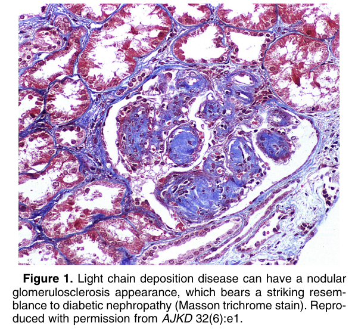
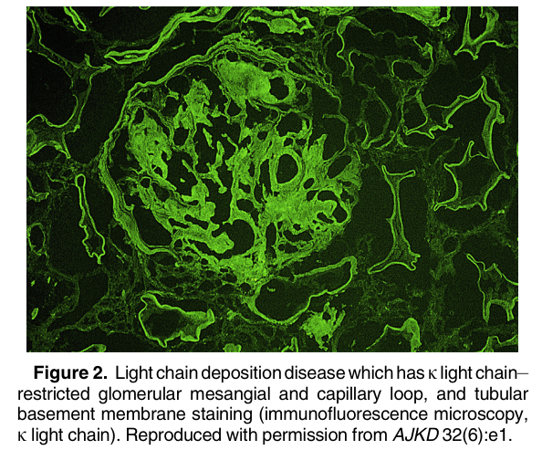
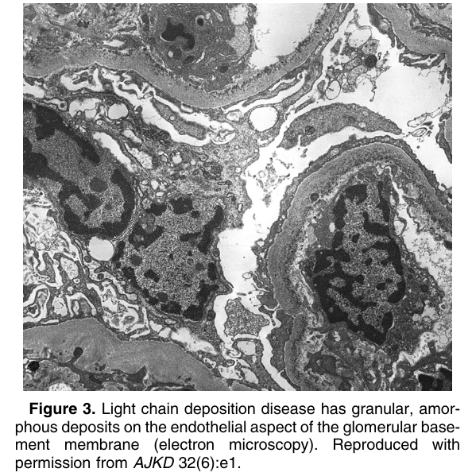
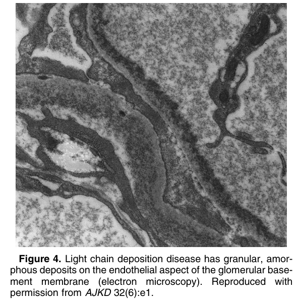
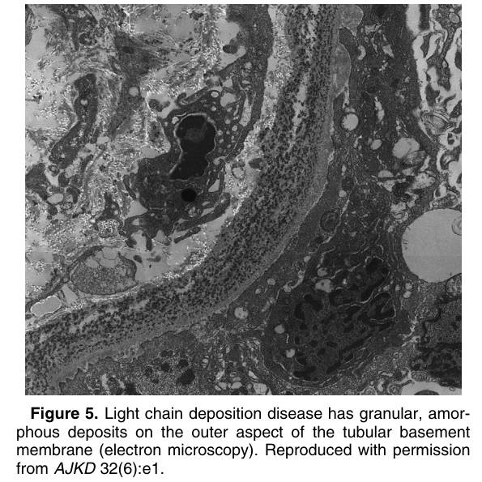

# Light Chain Deposition Disease - Figures and Tables Index

This document lists all figures and tables extracted from `Light Chain Deposition Disease.pdf`.

## Table of Contents
- [Figures](#figures)
- [Tables](#tables)

---

## Figures

### Fig_1

Figure 1. Light chain deposition disease can have a nodular glomerulosclerosis appearance, which bears a striking resemblance to diabetic nephropathy (Masson trichrome stain). Reproduced with permission from AJKD 32(6):e1.

---

### Fig_2

Figure 2. Light chain deposition disease which has k light chain– restricted glomerular mesangial and capillary loop, and tubular basement membrane staining (immunofluorescence microscopy, k light chain). Reproduced with permission from AJKD 32(6):e1.

---

### Fig_3

Figure 3. Light chain deposition disease has granular, amorphous deposits on the endothelial aspect of the glomerular basement membrane (electron microscopy). Reproduced with permission from AJKD 32(6):e1.

---

### Fig_4

Figure 4. Light chain deposition disease has granular, amorphous deposits on the endothelial aspect of the glomerular basement membrane (electron microscopy). Reproduced with permission from AJKD 32(6):e1.

---

### Fig_5

Figure 5. Light chain deposition disease has granular, amorphous deposits on the outer aspect of the tubular basement membrane (electron microscopy). Reproduced with permission from AJKD 32(6):e1.

---

## Tables

*No tables resolved for this chapter.*
