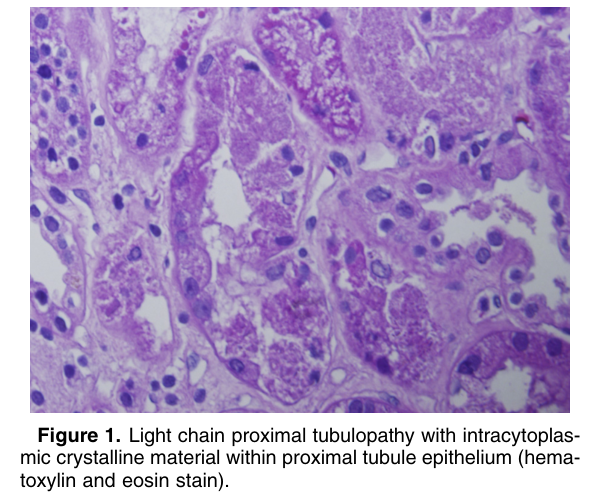
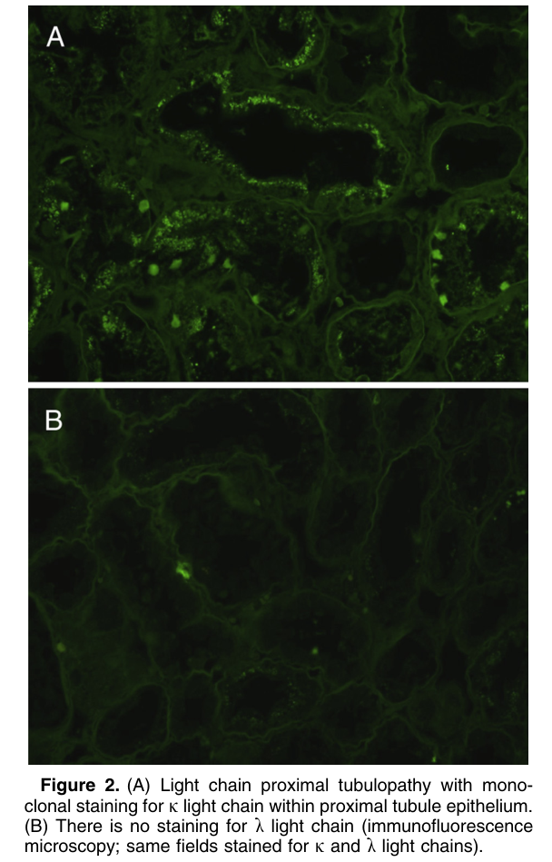
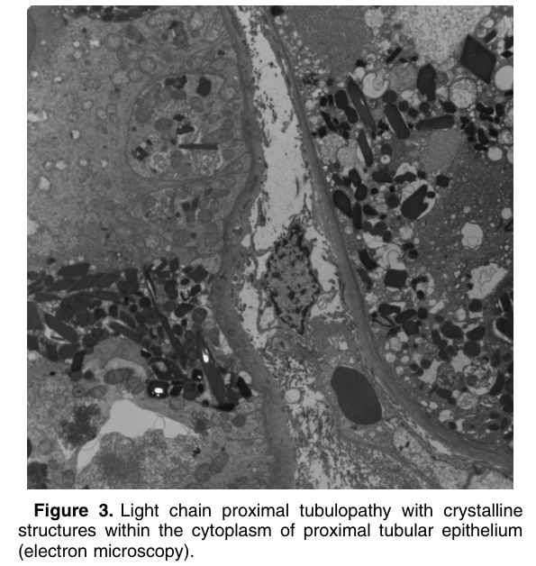

# Light Chain Proximal Tubulopathy - Figures and Tables Index

This document lists all figures and tables extracted from `Light Chain Proximal Tubulopathy.pdf`.

## Table of Contents
- [Figures](#figures)
- [Tables](#tables)

---

## Figures

### Fig_1

Figure 1. Light chain proximal tubulopathy with intracytoplasmic crystalline material within proximal tubule epithelium (hema toxylin and eosin stain).

---

### Fig_2

Figure 2. (A) Light chain proximal tubulopathy with monoclonal staining for k light chain within proximal tubule epithelium. (B) There is no staining for l light chain (immunofluorescence microscopy; same fields stained for k and l light chains).

---

### Fig_3

Figure 3. Light chain proximal tubulopathy with crystalline structures within the cytoplasm of proximal tubular epithelium (electron microscopy).

---

## Tables

*No tables resolved for this chapter.*
