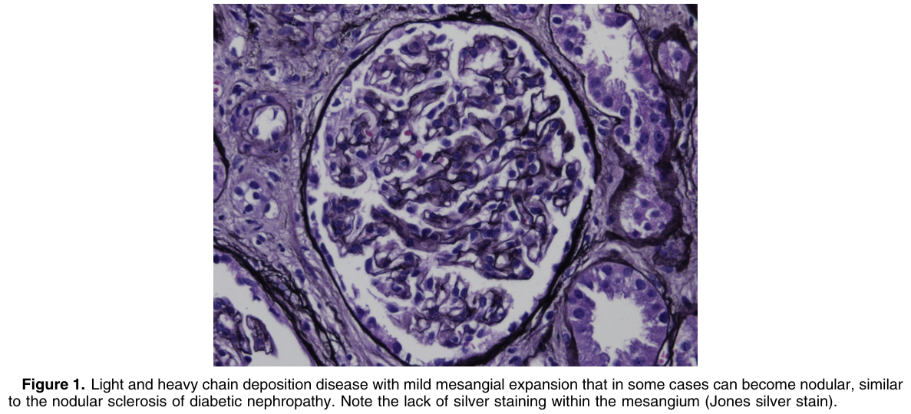
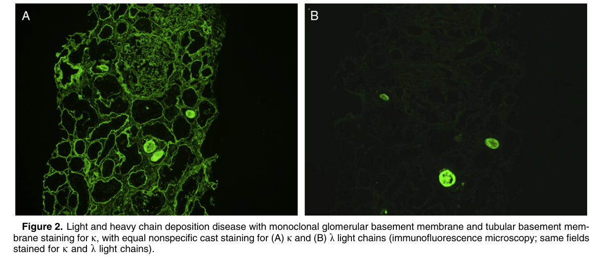
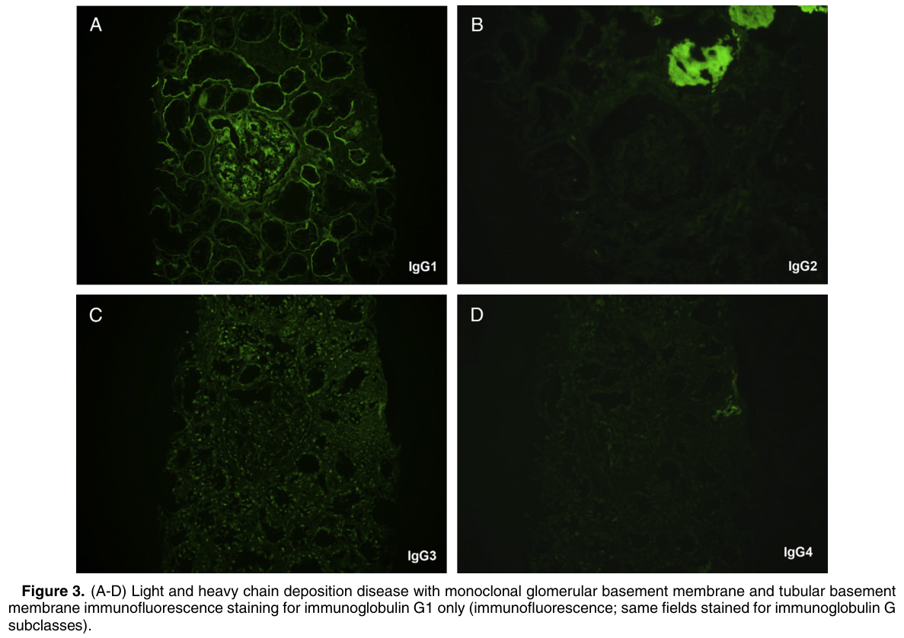
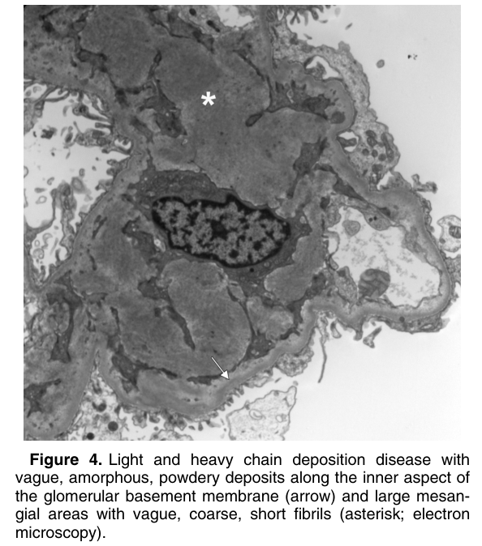
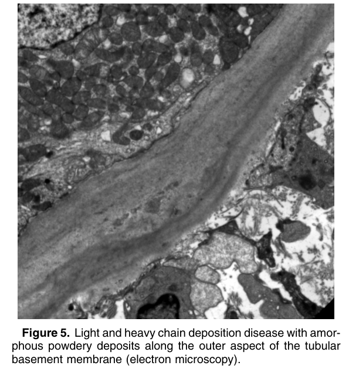

# Light and Heavy Chain Deposition Disease - Figures and Tables Index

This document lists all figures and tables extracted from `Light and Heavy Chain Deposition Disease.pdf`.

## Table of Contents
- [Figures](#figures)
- [Tables](#tables)

---

## Figures

### Fig_1

Figure 1. Light and heavy chain deposition disease with mild mesangial expansion that in some cases can become nodular, similar to the nodular sclerosis of diabetic nephropathy. Note the lack of silver staining within the mesangium (Jones silver stain).

---

### Fig_2

Figure 2. Light and heavy chain deposition disease with monoclonal glomerular basement membrane and tubular basement membrane staining for k, with equal nonspecific cast staining for (A) k and (B) l light chains (immunofluorescence microscopy; same fields stained for k and l light chains).

---

### Fig_3

Figure 3. (A-D) Light and heavy chain deposition disease with monoclonal glomerular basement membrane and tubular basement membrane immunofluorescence staining for immunoglobulin G1 only (immunofluorescence; same fields stained for immunoglobulin G subclasses).

---

### Fig_4

Figure 4. Light and heavy chain deposition disease with vague, amorphous, powdery deposits along the inner aspect of the glomerular basement membrane (arrow) and large mesangial areas with vague, coarse, short fibrils (asterisk; electron microscopy).

---

### Fig_5

Figure 5. Light and heavy chain deposition disease with amorphous powdery deposits along the outer aspect of the tubular basement membrane (electron microscopy).

---

## Tables

*No tables resolved for this chapter.*
