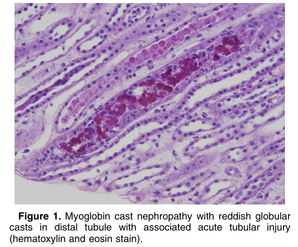
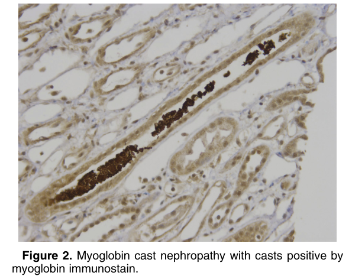

# Myoglobin Cast Nephropathy - Figures and Tables Index

This document lists all figures and tables extracted from `Myoglobin Cast Nephropathy.pdf`.

## Table of Contents
- [Figures](#figures)
- [Tables](#tables)

---

## Figures

### Fig_1

Figure 1. Myoglobin cast nephropathy with reddish globular casts in distal tubule with associated acute tubular injury (hematoxylin and eosin stain).

---

### Fig_2

Figure 2. Myoglobin cast nephropathy with casts positive by myoglobin immunostain.

---

## Tables

*No tables resolved for this chapter.*
