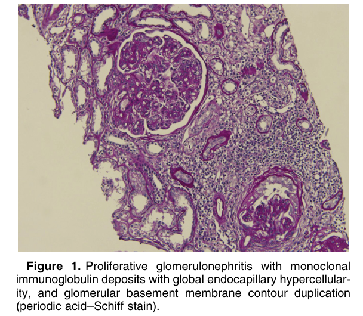
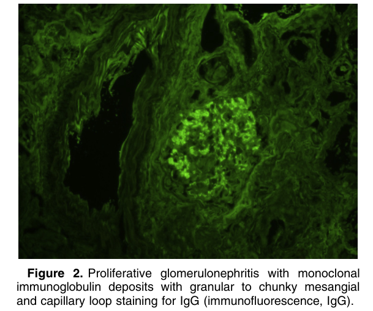
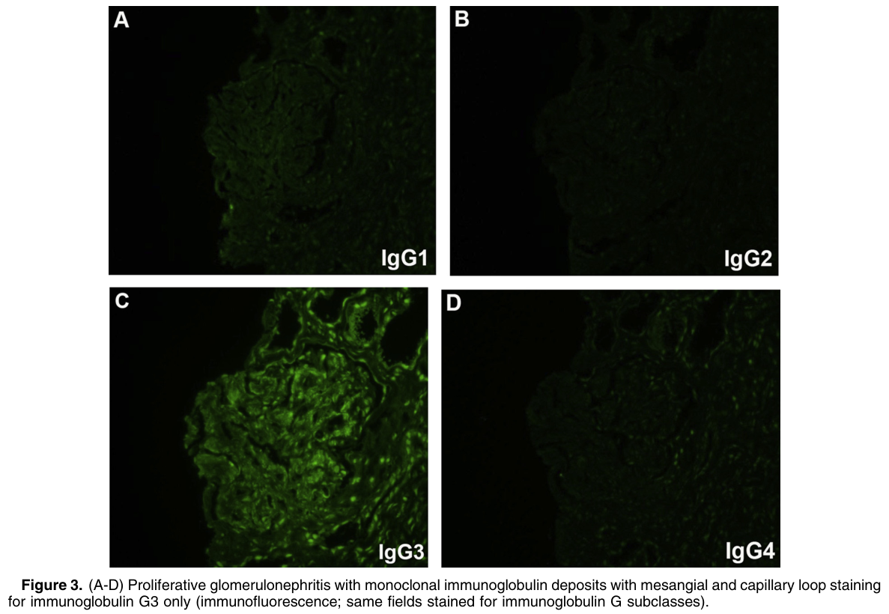
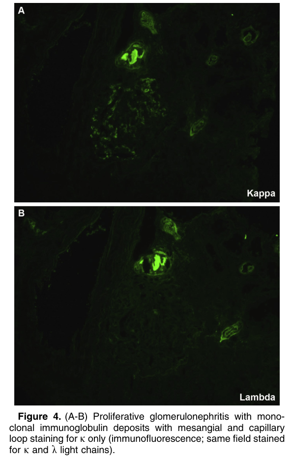
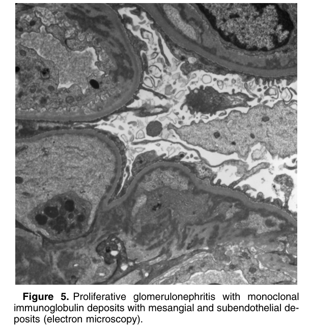

# Proliferative Glomerulonephritis With Monoclonal Immunoglobulin Deposits - Figures and Tables Index

This document lists all figures and tables extracted from `Proliferative Glomerulonephritis With Monoclonal Immunoglobulin Deposits.pdf`.

## Table of Contents
- [Figures](#figures)
- [Tables](#tables)

---

## Figures

### Fig_1

Figure 1. Proliferative glomerulonephritis with monoclonal immunoglobulin deposits with global endocapillary hypercellularity, and glomerular basement membrane contour duplication (periodic acid–Schiff stain).

---

### Fig_2

Figure 2. Proliferative glomerulonephritis with monoclonal immunoglobulin deposits with granular to chunky mesangial and capillary loop staining for IgG (immunofluorescence, IgG).

---

### Fig_3

Figure 3. (A-D) Proliferative glomerulonephritis with monoclonal immunoglobulin deposits with mesangial and capillary loop staining for immunoglobulin G3 only (immunofluorescence; same fields stained for immunoglobulin G subclasses).

---

### Fig_4

Figure 4. (A-B) Proliferative glomerulonephritis with monoclonal immunoglobulin deposits with mesangial and capillary loop staining for k only (immunofluorescence; same field stained for k and l light chains).

---

### Fig_5

Figure 5. Proliferative glomerulonephritis with monoclonal immunoglobulin deposits with mesangial and subendothelial deposits (electron microscopy).

---

## Tables

*No tables resolved for this chapter.*
