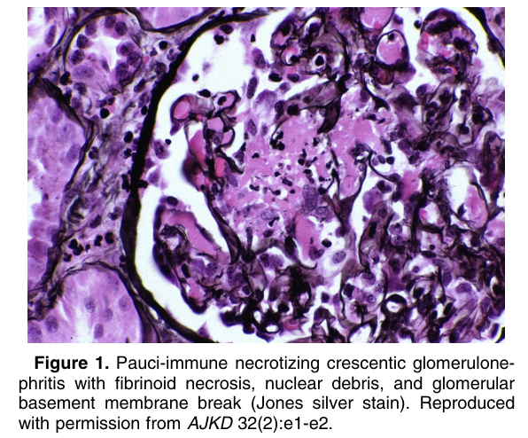
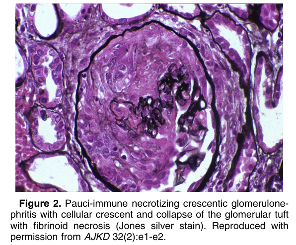
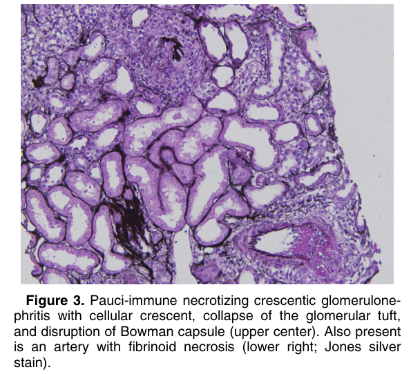
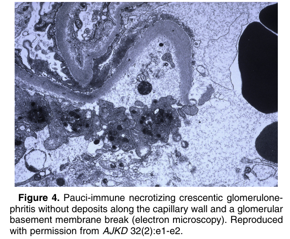

# Pauci-immune Necrotizing Crescentic Glomerulonephritis - Figures and Tables Index

This document lists all figures and tables extracted from `Pauci-immune Necrotizing Crescentic Glomerulonephritis.pdf`.

## Table of Contents
- [Figures](#figures)
- [Tables](#tables)

---

## Figures

### Fig_1

Figure 1. Pauci-immune necrotizing crescentic glomerulonephritis with fibrinoid necrosis, nuclear debris, and glomerular basement membrane break (Jones silver stain). Reproduced with permission from AJKD 32(2):e1-e2.

---

### Fig_2

Figure 2. Pauci-immune necrotizing crescentic glomerulonephritis with cellular crescent and collapse of the glomerular tuft with fibrinoid necrosis (Jones silver stain). Reproduced with permission from AJKD 32(2):e1-e2.

---

### Fig_3

Figure 3. Pauci-immune necrotizing crescentic glomerulonephritis with cellular crescent, collapse of the glomerular tuft, and disruption of Bowman capsule (upper center). Also present is an artery with fibrinoid necrosis (lower right; Jones silver stain).

---

### Fig_4

Figure 4. Pauci-immune necrotizing crescentic glomerulonephritis without deposits along the capillary wall and a glomerular basement membrane break (electron microscopy). Reproduced with permission from AJKD 32(2):e1-e2.

---

## Tables

*No tables resolved for this chapter.*
