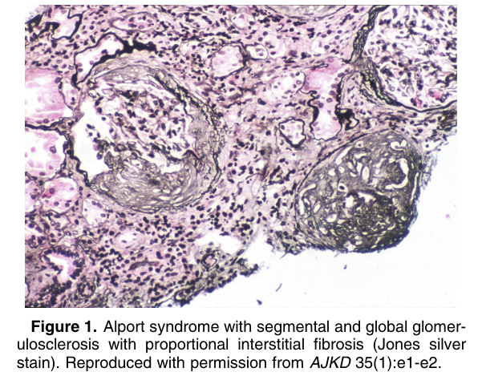
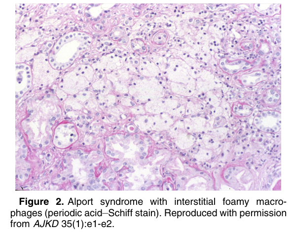
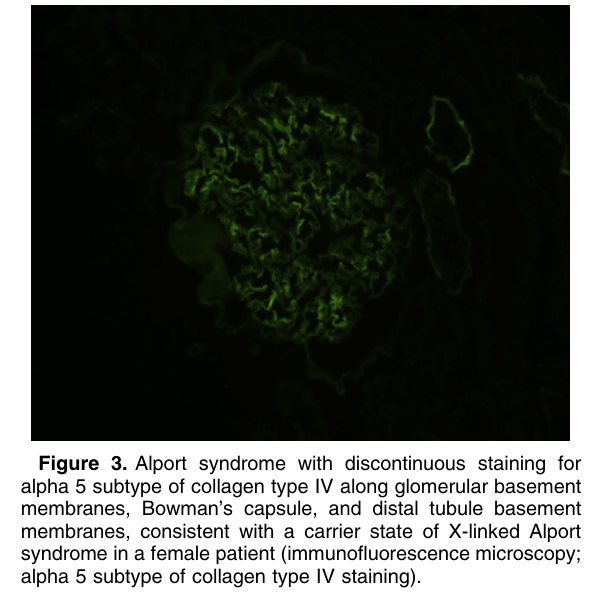
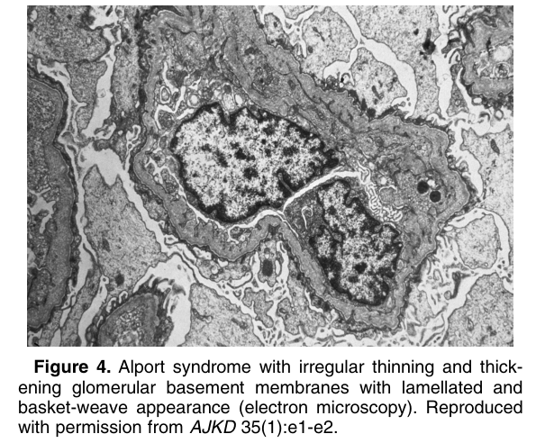
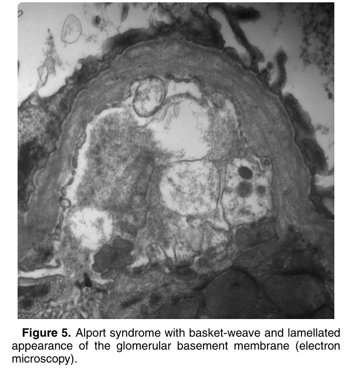

# Alport Syndrome - Figures and Tables Index

This document lists all figures and tables extracted from `Alport Syndrome.pdf`.

## Table of Contents
- [Figures](#figures)
- [Tables](#tables)

---

## Figures

### Fig_1

Figure 1. Alport syndrome with segmental and global glomerulosclerosis with proportional interstitial fibrosis (Jones silver stain). Reproduced with permission from AJKD 35(1):e1-e2.

---

### Fig_2

Figure 2. Alport syndrome with interstitial foamy macrophages (periodic acid–Schiff stain). Reproduced with permission from AJKD 35(1):e1-e2.

---

### Fig_3

Figure 3. Alport syndrome with discontinuous staining for alpha 5 subtype of collagen type IV along glomerular basement membranes, Bowman’s capsule, and distal tubule basement membranes, consistent with a carrier state of X-linked Alport syndrome in a female patient (immunofluorescence microscopy; alpha 5 subtype of collagen type IV staining).

---

### Fig_4

Figure 4. Alport syndrome with irregular thinning and thickening glomerular basement membranes with lamellated and basket-weave appearance (electron microscopy). Reproduced with permission from AJKD 35(1):e1-e2.

---

### Fig_5

Figure 5. Alport syndrome with basket-weave and lamellated appearance of the glomerular basement membrane (electron microscopy).

---

## Tables

*No tables resolved for this chapter.*
