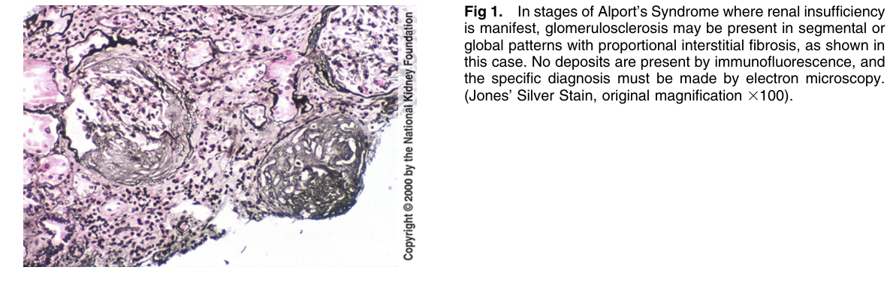
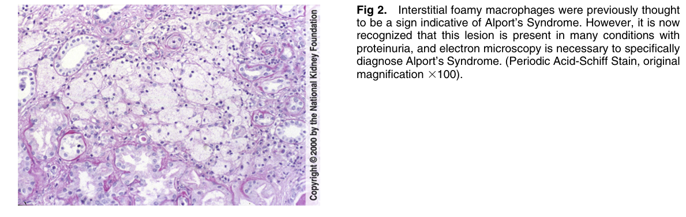
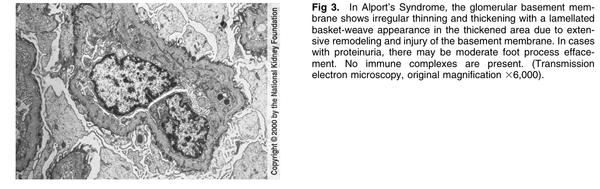
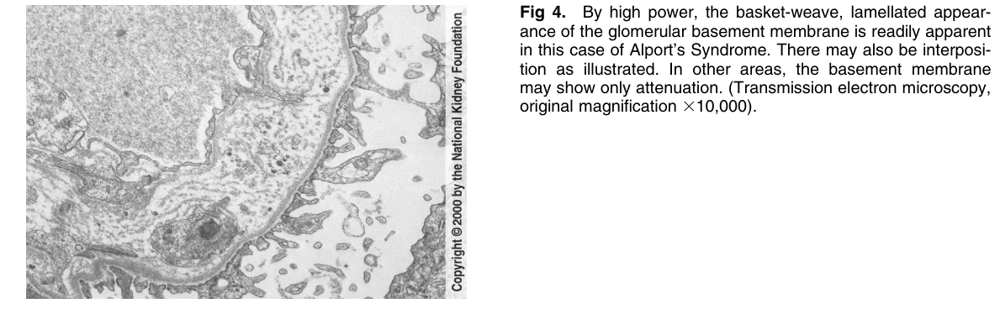

# Alport’s Syndrome - Figures and Tables Index

This document lists all figures and tables extracted from `Alport’s Syndrome.pdf`.

## Table of Contents
- [Figures](#figures)
- [Tables](#tables)

---

## Figures

### Fig_1

Figure 1. In stages of Alport’s Syndrome where renal insufficiency is manifest, glomerulosclerosis may be present in segmental or global patterns with proportional interstitial fibrosis, as shown in this case. No deposits are present by immunofluorescence, and the specific diagnosis must be made by electron microscopy. (Jones’ Silver Stain, original magnification 3100).

---

### Fig_2

Figure 2. Interstitial foamy macrophages were previously though to be a sign indicative of Alport’s Syndrome. However, it is now recognized that this lesion is present in many conditions with proteinuria, and electron microscopy is necessary to specifically diagnose Alport’s Syndrome. (Periodic Acid-Schiff Stain, origina magnification 3100).

---

### Fig_3

Figure 3. In Alport’s Syndrome, the glomerular basement membrane shows irregular thinning and thickening with a lamellated basket-weave appearance in the thickened area due to extensive remodeling and injury of the basement membrane. In cases with proteinuria, there may be moderate foot process effacement. No immune complexes are present. (Transmission electron microscopy, original magnification 36,000).

---

### Fig_4

Figure 4. By high power, the basket-weave, lamellated appearance of the glomerular basement membrane is readily apparent in this case of Alport’s Syndrome. There may also be interposition as illustrated. In other areas, the basement membrane may show only attenuation. (Transmission electron microscopy, original magnification 310,000).

---

## Tables

*No tables resolved for this chapter.*
