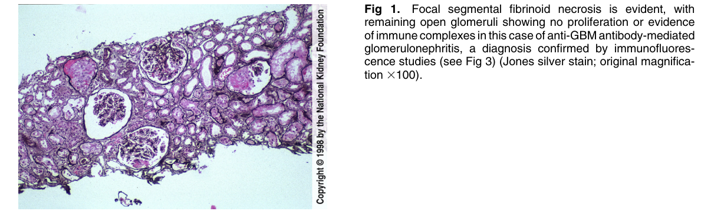
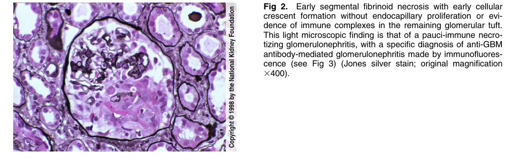
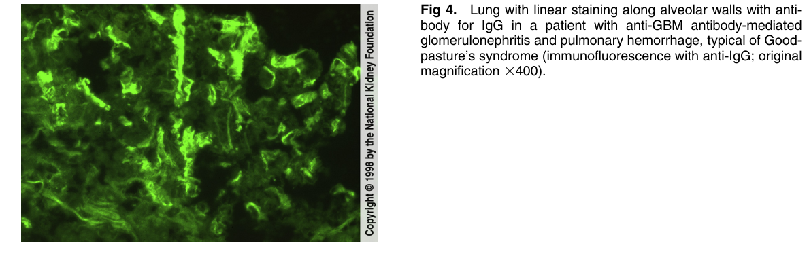

# Anti-GBM Antibody Mediated Glomerulonephritis - Figures and Tables Index

This document lists all figures and tables extracted from `Anti-GBM Antibody Mediated Glomerulonephritis.pdf`.

## Table of Contents
- [Figures](#figures)
- [Tables](#tables)

---

## Figures

### Fig_1

Figure 1. Focal segmental fibrinoid necrosis is evident, with remaining open glomeruli showing no proliferation or evidence of immune complexes in this case of anti-GBM antibody-mediated glomerulonephritis, a diagnosis confirmed by immunofluorescence studies (see Fig 3) (Jones silver stain; original magnification 3100).

---

### Fig_2

Figure 2. Early segmental fibrinoid necrosis with early cellular crescent formation without endocapillary proliferation or evidence of immune complexes in the remaining glomerular tuft. This light microscopic finding is that of a pauci-immune necrotizing glomerulonephritis, with a specific diagnosis of anti-GBM antibody-mediated glomerulonephritis made by immunofluorescence (see Fig 3) (Jones silver stain; original magnification 3400).

---

### Fig_4

Figure 4. Lung with linear staining along alveolar walls with anti body for IgG in a patient with anti-GBM antibody-mediated glomerulonephritis and pulmonary hemorrhage, typical of Good pasture’s syndrome (immunofluorescence with anti-IgG; origina magnification 3400).

---

## Tables

*No tables resolved for this chapter.*
