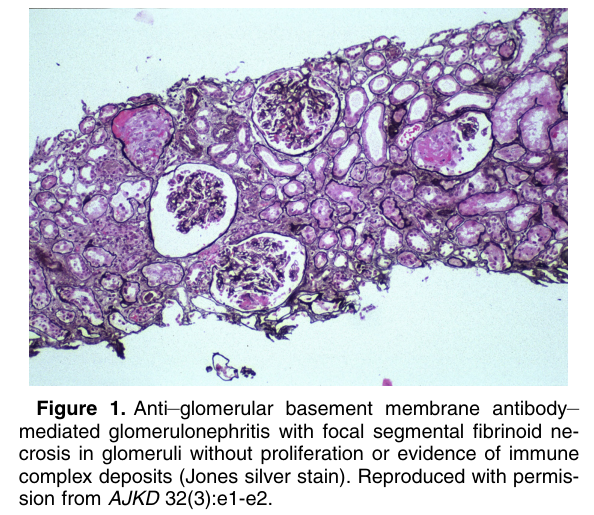
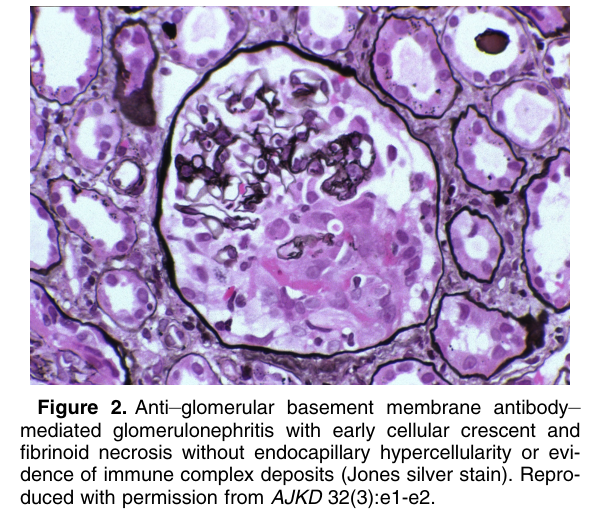
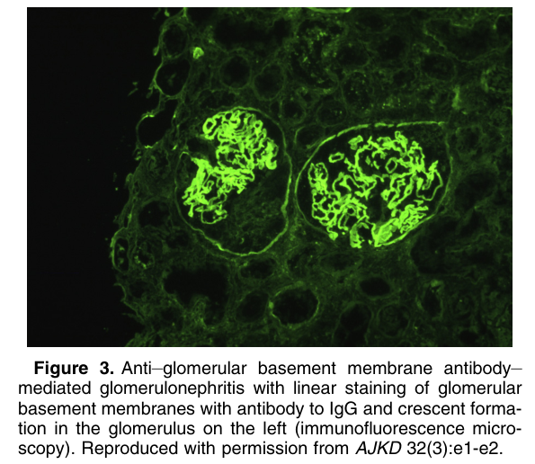

# Anti–Glomerular Basement Membrane Antibody–Mediated Glomerulonephritis - Figures and Tables Index

This document lists all figures and tables extracted from `Anti–Glomerular Basement Membrane Antibody–Mediated Glomerulonephritis.pdf`.

## Table of Contents
- [Figures](#figures)
- [Tables](#tables)

---

## Figures

### Fig_1

Figure 1. Anti–glomerular basement membrane antibody– mediated glomerulonephritis with focal segmental fibrinoid necrosis in glomeruli without proliferation or evidence of immune complex deposits (Jones silver stain). Reproduced with permission from AJKD 32(3):e1-e2.

---

### Fig_2

Figure 2. Anti–glomerular basement membrane antibody– mediated glomerulonephritis with early cellular crescent and fibrinoid necrosis without endocapillary hypercellularity or evidence of immune complex deposits (Jones silver stain). Reproduced with permission from AJKD 32(3):e1-e2.

---

### Fig_3

Figure 3. Anti–glomerular basement membrane antibody– mediated glomerulonephritis with linear staining of glomerular basement membranes with antibody to IgG and crescent forma tion in the glomerulus on the left (immunofluorescence microscopy). Reproduced with permission from AJKD 32(3):e1-e2.

---

## Tables

*No tables resolved for this chapter.*
