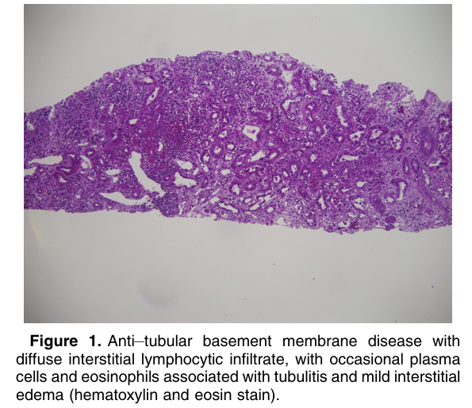
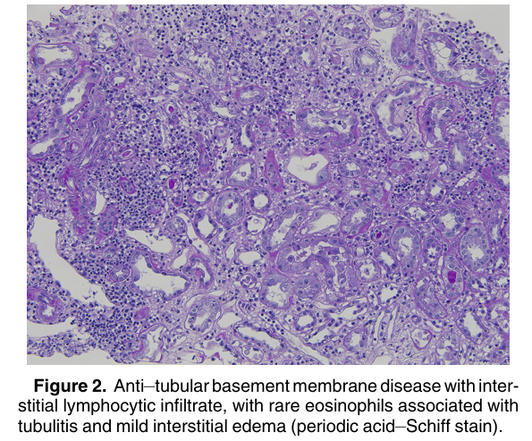
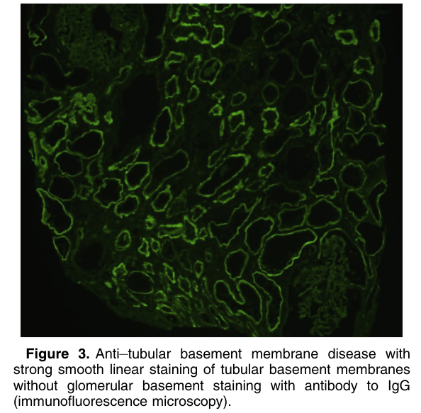

# Anti–Tubular Basement Membrane Antibody Disease - Figures and Tables Index

This document lists all figures and tables extracted from `Anti–Tubular Basement Membrane Antibody Disease.pdf`.

## Table of Contents
- [Figures](#figures)
- [Tables](#tables)

---

## Figures

### Fig_1

Figure 1. Anti–tubular basement membrane disease with diffuse interstitial lymphocytic infiltrate, with occasional plasma cells and eosinophils associated with tubulitis and mild interstitial edema (hematoxylin and eosin stain).

---

### Fig_2

Figure 2. Anti–tubular basement membrane disease with interstitial lymphocytic infiltrate, with rare eosinophils associated with tubulitis and mild interstitial edema (periodic acid–Schiff stain).

---

### Fig_3

Figure 3. Anti–tubular basement membrane disease with strong smooth linear staining of tubular basement membranes without glomerular basement staining with antibody to IgG (immunofluorescence microscopy).

---

## Tables

*No tables resolved for this chapter.*
