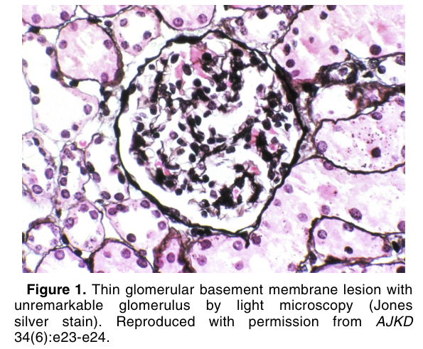
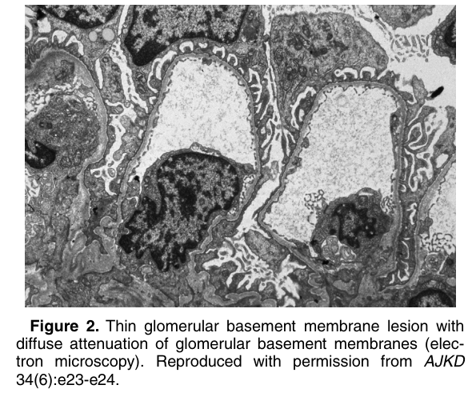
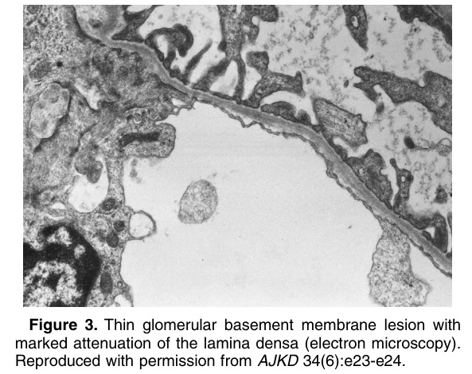

# Thin Basement Membrane Lesion - Figures and Tables Index

This document lists all figures and tables extracted from `Thin Basement Membrane Lesion.pdf`.

## Table of Contents
- [Figures](#figures)
- [Tables](#tables)

---

## Figures

### Fig_1

Figure 1. Thin glomerular basement membrane lesion with unremarkable glomerulus by light microscopy (Jones silver stain). Reproduced with permission from AJKD 34(6):e23-e24.

---

### Fig_2

Figure 2. Thin glomerular basement membrane lesion with diffuse attenuation of glomerular basement membranes (electron microscopy). Reproduced with permission from AJKD 34(6):e23-e24.

---

### Fig_3

Figure 3. Thin glomerular basement membrane lesion with marked attenuation of the lamina densa (electron microscopy). Reproduced with permission from AJKD 34(6):e23-e24.

---

## Tables

*No tables resolved for this chapter.*
