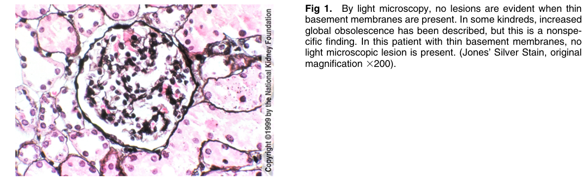
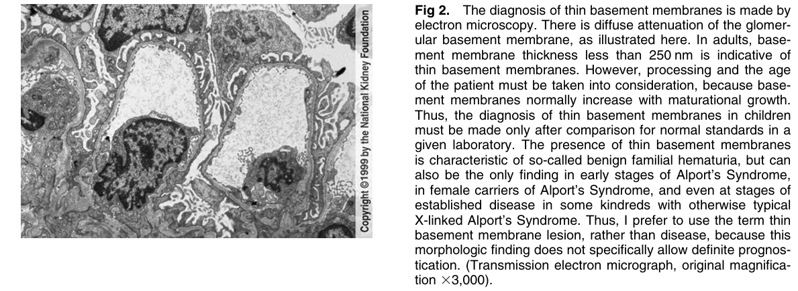
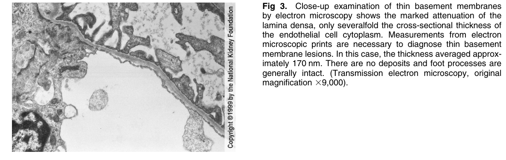

# Thin Glomerular Basement Membranes - Figures and Tables Index

This document lists all figures and tables extracted from `Thin Glomerular Basement Membranes.pdf`.

## Table of Contents
- [Figures](#figures)
- [Tables](#tables)

---

## Figures

### Fig_1

Figure 1. By light microscopy, no lesions are evident when thin basement membranes are present. In some kindreds, increased global obsolescence has been described, but this is a nonspecific finding. In this patient with thin basement membranes, no light microscopic lesion is present. (Jones’ Silver Stain, origina magnification 3200).

---

### Fig_2

Figure 2. The diagnosis of thin basement membranes is made by electron microscopy. There is diffuse attenuation of the glomerular basement membrane, as illustrated here. In adults, basement membrane thickness less than 250 nm is indicative of thin basement membranes. However, processing and the age of the patient must be taken into consideration, because basement membranes normally increase with maturational growth. Thus, the diagnosis of thin basement membranes in children must be made only after comparison for normal standards in a given laboratory. The presence of thin basement membranes is characteristic of so-called benign familial hematuria, but can also be the only finding in early stages of Alport’s Syndrome, in female carriers of Alport’s Syndrome, and even at stages of established disease in some kindreds with otherwise typica X-linked Alport’s Syndrome. Thus, I prefer to use the term thin basement membrane lesion, rather than disease, because this morphologic finding does not specifically allow definite prognostication. (Transmission electron micrograph, original magnification 33,000).

---

### Fig_3

Figure 3. Close-up examination of thin basement membranes by electron microscopy shows the marked attenuation of the lamina densa, only severalfold the cross-sectional thickness o the endothelial cell cytoplasm. Measurements from electron microscopic prints are necessary to diagnose thin basement membrane lesions. In this case, the thickness averaged approximately 170 nm. There are no deposits and foot processes are generally intact. (Transmission electron microscopy, original magnification 39,000).

---

## Tables

*No tables resolved for this chapter.*
