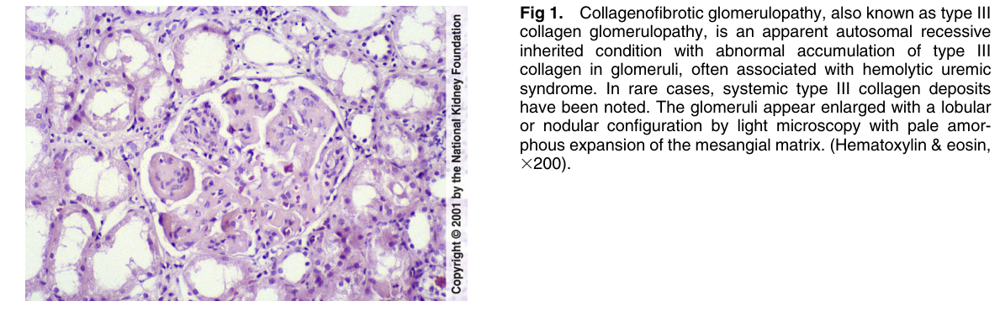
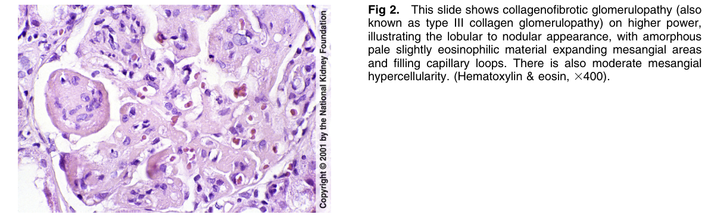
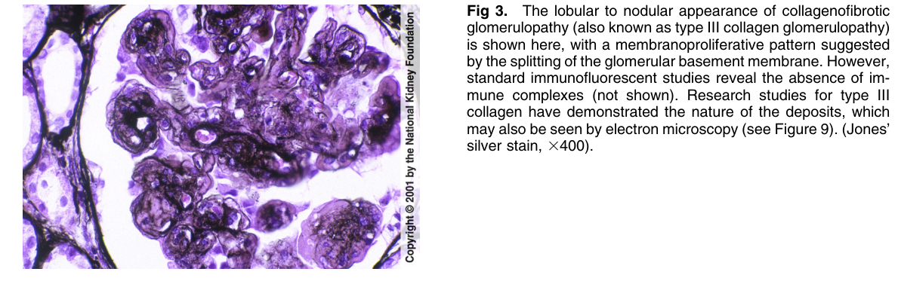
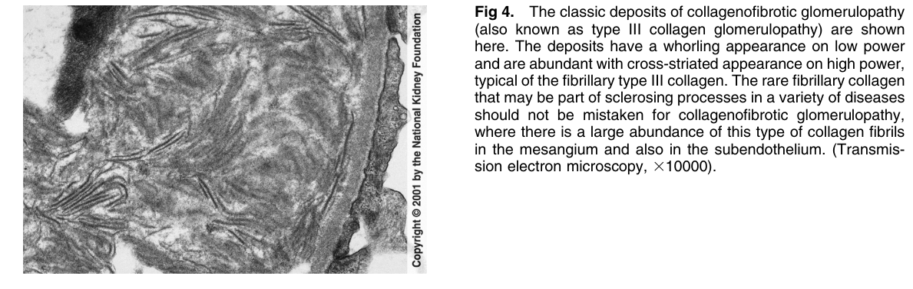

# Type III Collagen Glomerulopathy (Collagenofibrotic Glomerulopathy) - Figures and Tables Index

This document lists all figures and tables extracted from `Type III Collagen Glomerulopathy (Collagenofibrotic Glomerulopathy).pdf`.

## Table of Contents
- [Figures](#figures)
- [Tables](#tables)

---

## Figures

### Fig_1

Figure 1. Collagenofibrotic glomerulopathy, also known as type III collagen glomerulopathy, is an apparent autosomal recessive inherited condition with abnormal accumulation of type III collagen in glomeruli, often associated with hemolytic uremic syndrome. In rare cases, systemic type III collagen deposits have been noted. The glomeruli appear enlarged with a lobular or nodular configuration by light microscopy with pale amorphous expansion of the mesangial matrix. (Hematoxylin & eosin, 3200).

---

### Fig_2

Figure 2. This slide shows collagenofibrotic glomerulopathy (also known as type III collagen glomerulopathy) on higher power, illustrating the lobular to nodular appearance, with amorphous pale slightly eosinophilic material expanding mesangial areas and filling capillary loops. There is also moderate mesangia hypercellularity. (Hematoxylin & eosin, 3400).

---

### Fig_3

Figure 3. The lobular to nodular appearance of collagenofibrotic glomerulopathy (also known as type III collagen glomerulopathy) is shown here, with a membranoproliferative pattern suggested by the splitting of the glomerular basement membrane. However, standard immunofluorescent studies reveal the absence of im mune complexes (not shown). Research studies for type III collagen have demonstrated the nature of the deposits, which may also be seen by electron microscopy (see Figure 9). (Jones silver stain, 3400).

---

### Fig_4

Figure 4. The classic deposits of collagenofibrotic glomerulopath (also known as type III collagen glomerulopathy) are shown here. The deposits have a whorling appearance on low power and are abundant with cross-striated appearance on high power, typical of the fibrillary type III collagen. The rare fibrillary collagen that may be part of sclerosing processes in a variety of diseases should not be mistaken for collagenofibrotic glomerulopathy, where there is a large abundance of this type of collagen fibrils in the mesangium and also in the subendothelium. (Transmission electron microscopy, 310000).

---

## Tables

*No tables resolved for this chapter.*
