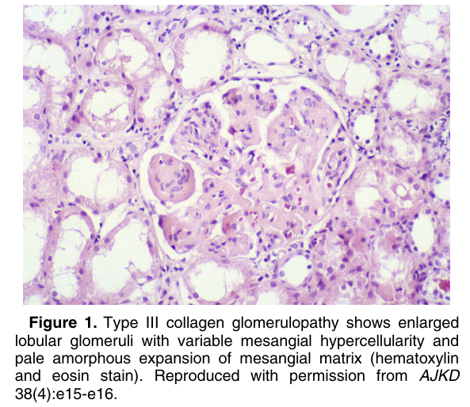
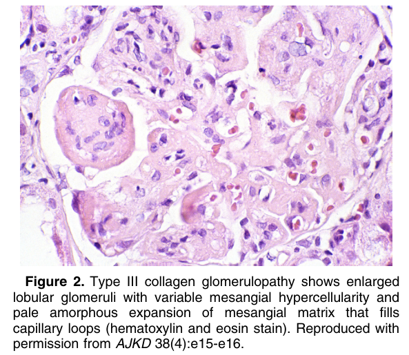
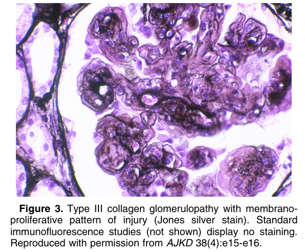
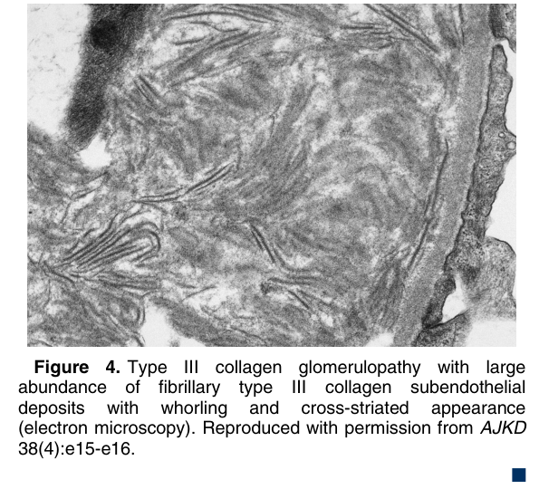

# Type III Collagen Glomerulopathy - Figures and Tables Index

This document lists all figures and tables extracted from `Type III Collagen Glomerulopathy.pdf`.

## Table of Contents
- [Figures](#figures)
- [Tables](#tables)

---

## Figures

### Fig_1

Figure 1. Type III collagen glomerulopathy shows enlarged lobular glomeruli with variable mesangial hypercellularity and pale amorphous expansion of mesangial matrix (hematoxylin and eosin stain). Reproduced with permission from AJKD 38(4):e15-e16.

---

### Fig_2

Figure 2. Type III collagen glomerulopathy shows enlarged lobular glomeruli with variable mesangial hypercellularity and pale amorphous expansion of mesangial matrix that fills capillary loops (hematoxylin and eosin stain). Reproduced with permission from AJKD 38(4):e15-e16.

---

### Fig_3

Figure 3. Type III collagen glomerulopathy with membranoproliferative pattern of injury (Jones silver stain). Standard immunofluorescence studies (not shown) display no staining. Reproduced with permission from AJKD 38(4):e15-e16.

---

### Fig_4

Figure 4. Type III collagen glomerulopathy with large abundance of fibrillary type III collagen subendothelial deposits with whorling and cross-striated appearance (electron microscopy). Reproduced with permission from AJKD 38(4):e15-e16. -

---

## Tables

*No tables resolved for this chapter.*
