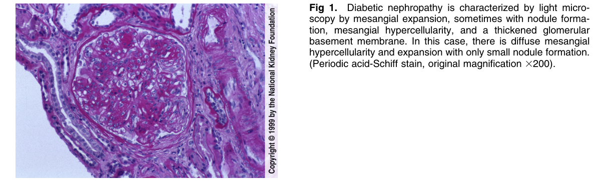
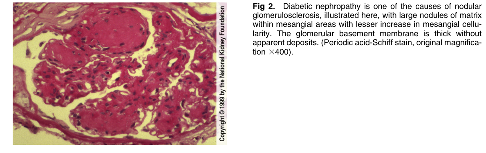
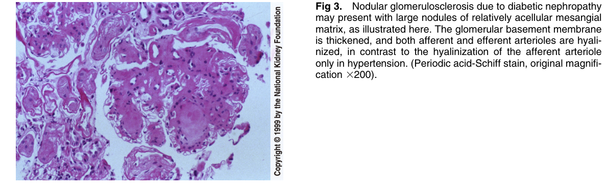
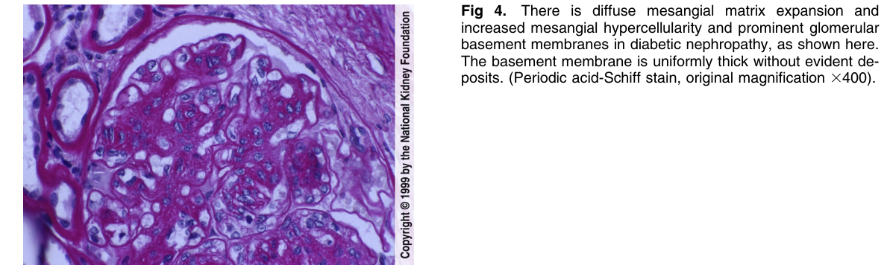
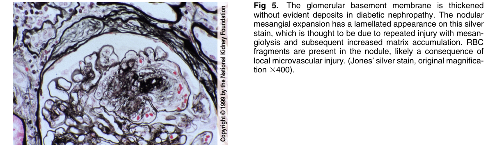
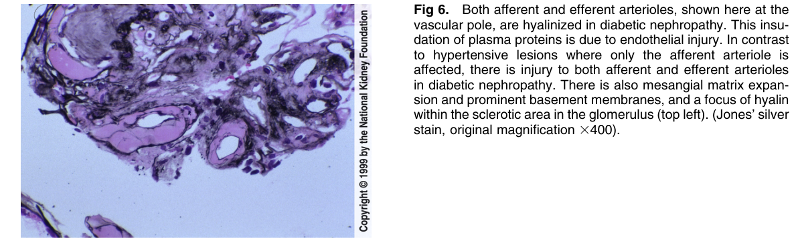
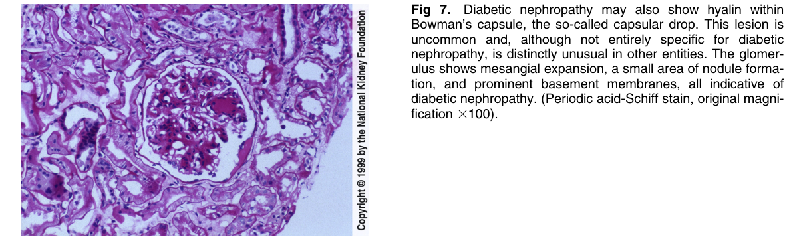
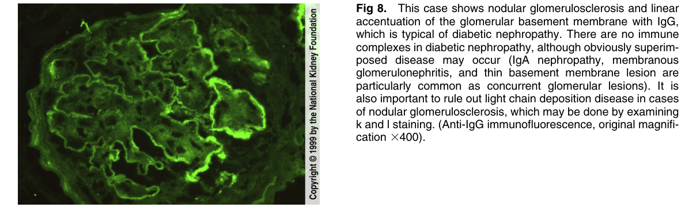
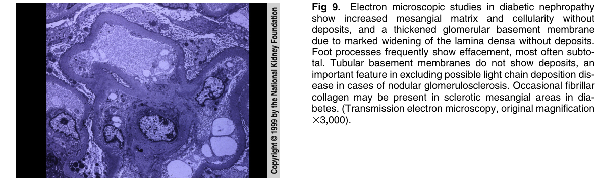

# Diabetic Nephropathy 2 - Figures and Tables Index

This document lists all figures and tables extracted from `Diabetic Nephropathy 2.pdf`.

## Table of Contents
- [Figures](#figures)
- [Tables](#tables)

---

## Figures

### Fig_1

Figure 1. Diabetic nephropathy is characterized by light microscopy by mesangial expansion, sometimes with nodule formation, mesangial hypercellularity, and a thickened glomerular basement membrane. In this case, there is diffuse mesangia hypercellularity and expansion with only small nodule formation. (Periodic acid-Schiff stain, original magnification 3200).

---

### Fig_2

Figure 2. Diabetic nephropathy is one of the causes of nodular glomerulosclerosis, illustrated here, with large nodules of matrix within mesangial areas with lesser increase in mesangial cellularity. The glomerular basement membrane is thick without apparent deposits. (Periodic acid-Schiff stain, original magnification 3400).

---

### Fig_3

Figure 3. Nodular glomerulosclerosis due to diabetic nephropath may present with large nodules of relatively acellular mesangia matrix, as illustrated here. The glomerular basement membrane is thickened, and both afferent and efferent arterioles are hyalinized, in contrast to the hyalinization of the afferent arteriole only in hypertension. (Periodic acid-Schiff stain, original magnifi cation 3200).

---

### Fig_4

Figure 4. There is diffuse mesangial matrix expansion and increased mesangial hypercellularity and prominent glomerular basement membranes in diabetic nephropathy, as shown here. The basement membrane is uniformly thick without evident deposits. (Periodic acid-Schiff stain, original magnification 3400)

---

### Fig_5

Figure 5. The glomerular basement membrane is thickened without evident deposits in diabetic nephropathy. The nodular mesangial expansion has a lamellated appearance on this silver stain, which is thought to be due to repeated injury with mesangiolysis and subsequent increased matrix accumulation. RBC fragments are present in the nodule, likely a consequence of local microvascular injury. (Jones’ silver stain, original magnification 3400).

---

### Fig_6

Figure 6. Both afferent and efferent arterioles, shown here at the vascular pole, are hyalinized in diabetic nephropathy. This insudation of plasma proteins is due to endothelial injury. In contrast to hypertensive lesions where only the afferent arteriole is affected, there is injury to both afferent and efferent arterioles in diabetic nephropathy. There is also mesangial matrix expansion and prominent basement membranes, and a focus of hyalin within the sclerotic area in the glomerulus (top left). (Jones’ silver stain, original magnification 3400).

---

### Fig_7

Figure 7. Diabetic nephropathy may also show hyalin within Bowman’s capsule, the so-called capsular drop. This lesion is uncommon and, although not entirely specific for diabetic nephropathy, is distinctly unusual in other entities. The glomerulus shows mesangial expansion, a small area of nodule formation, and prominent basement membranes, all indicative of diabetic nephropathy. (Periodic acid-Schiff stain, original magnification 3100).

---

### Fig_8

Figure 8. This case shows nodular glomerulosclerosis and linear accentuation of the glomerular basement membrane with IgG, which is typical of diabetic nephropathy. There are no immune complexes in diabetic nephropathy, although obviously superimposed disease may occur (IgA nephropathy, membranous glomerulonephritis, and thin basement membrane lesion are particularly common as concurrent glomerular lesions). It is also important to rule out light chain deposition disease in cases of nodular glomerulosclerosis, which may be done by examining k and l staining. (Anti-IgG immunofluorescence, original magnification 3400).

---

### Fig_9

Figure 9. Electron microscopic studies in diabetic nephropath show increased mesangial matrix and cellularity withou deposits, and a thickened glomerular basement membrane due to marked widening of the lamina densa without deposits. Foot processes frequently show effacement, most often subtotal. Tubular basement membranes do not show deposits, an important feature in excluding possible light chain deposition disease in cases of nodular glomerulosclerosis. Occasional fibrillar collagen may be present in sclerotic mesangial areas in diabetes. (Transmission electron microscopy, original magnification 33,000).

---

## Tables

*No tables resolved for this chapter.*
