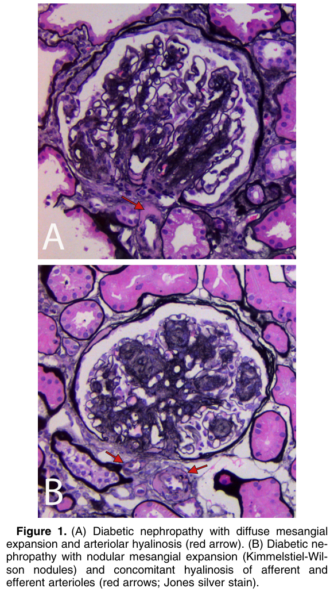
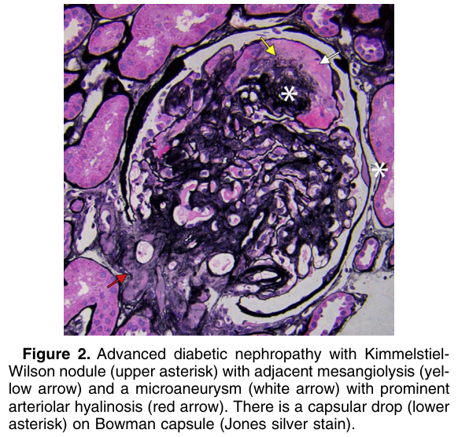
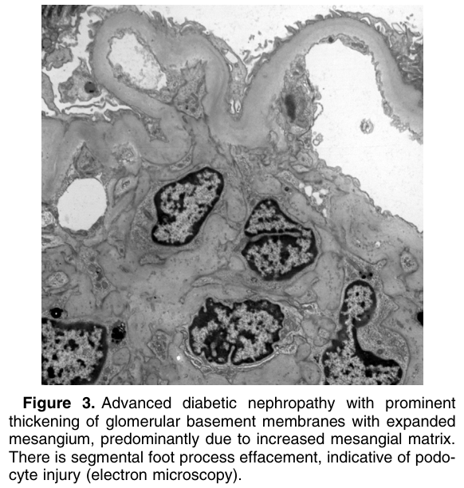
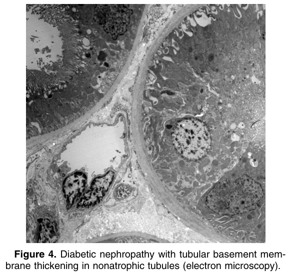

# Diabetic Nephropathy - Figures and Tables Index

This document lists all figures and tables extracted from `Diabetic Nephropathy.pdf`.

## Table of Contents
- [Figures](#figures)
- [Tables](#tables)

---

## Figures

### Fig_1

Figure 1. (A) Diabetic nephropathy with diffuse mesangial expansion and arteriolar hyalinosis (red arrow). (B) Diabetic nephropathy with nodular mesangial expansion (Kimmelstiel-Wilson nodules) and concomitant hyalinosis of afferent and efferent arterioles (red arrows; Jones silver stain).

---

### Fig_2

Figure 2. Advanced diabetic nephropathy with Kimmelstiel-Wilson nodule (upper asterisk) with adjacent mesangiolysis (yellow arrow) and a microaneurysm (white arrow) with prominent arteriolar hyalinosis (red arrow). There is a capsular drop (lower asterisk) on Bowman capsule (Jones silver stain).

---

### Fig_3

Figure 3. Advanced diabetic nephropathy with prominent thickening of glomerular basement membranes with expanded mesangium, predominantly due to increased mesangial matrix. There is segmental foot process effacement, indicative of podocyte injury (electron microscopy).

---

### Fig_4

Figure 4. Diabetic nephropathy with tubular basement mem brane thickening in nonatrophic tubules (electron microscopy).

---

## Tables

*No tables resolved for this chapter.*
