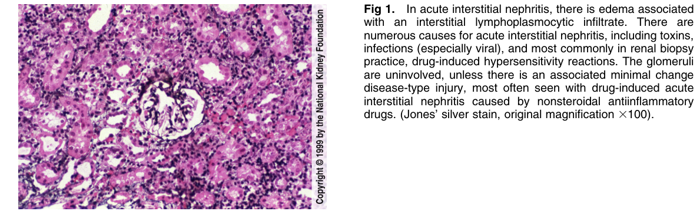
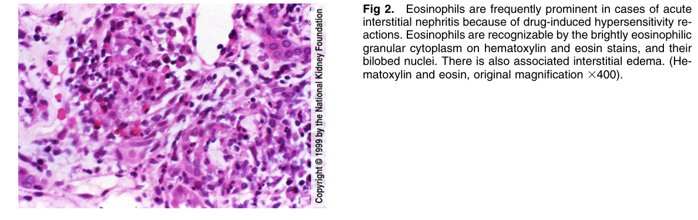

# Acute Interstitial Nephritis 2 - Figures and Tables Index

This document lists all figures and tables extracted from `Acute Interstitial Nephritis 2.pdf`.

## Table of Contents
- [Figures](#figures)
- [Tables](#tables)

---

## Figures

### Fig_1

Figure 1. In acute interstitial nephritis, there is edema associated with an interstitial lymphoplasmocytic infiltrate. There are numerous causes for acute interstitial nephritis, including toxins, infections (especially viral), and most commonly in renal biopsy practice, drug-induced hypersensitivity reactions. The glomerul are uninvolved, unless there is an associated minimal change disease-type injury, most often seen with drug-induced acute interstitial nephritis caused by nonsteroidal antiinflammatory drugs. (Jones’ silver stain, original magnification 3100).

---

### Fig_2

Figure 2. Eosinophils are frequently prominent in cases of acute interstitial nephritis because of drug-induced hypersensitivity reactions. Eosinophils are recognizable by the brightly eosinophilic granular cytoplasm on hematoxylin and eosin stains, and their bilobed nuclei. There is also associated interstitial edema. (Hematoxylin and eosin, original magnification 3400).

---

## Tables

*No tables resolved for this chapter.*
