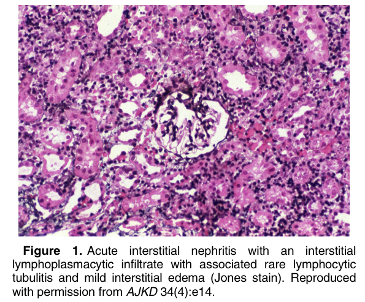
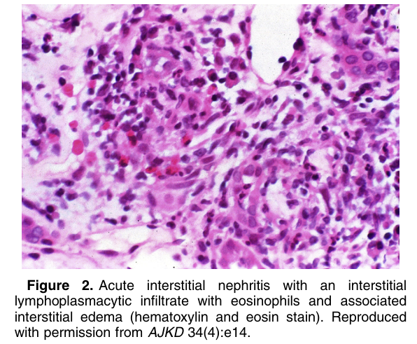
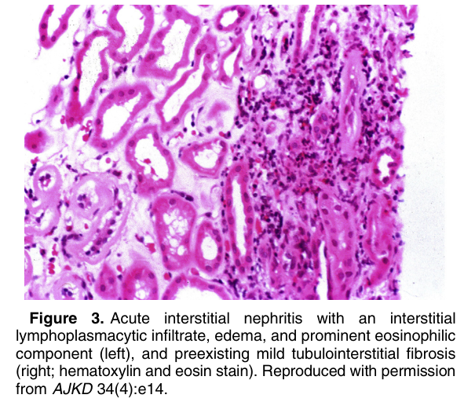

# Acute Interstitial Nephritis - Figures and Tables Index

This document lists all figures and tables extracted from `Acute Interstitial Nephritis.pdf`.

## Table of Contents
- [Figures](#figures)
- [Tables](#tables)

---

## Figures

### Fig_1

Figure 1. Acute interstitial nephritis with an interstitial lymphoplasmacytic infiltrate with associated rare lymphocytic tubulitis and mild interstitial edema (Jones stain). Reproduced with permission from AJKD 34(4):e14.

---

### Fig_2

Figure 2. Acute interstitial nephritis with an interstitial lymphoplasmacytic infiltrate with eosinophils and associated interstitial edema (hematoxylin and eosin stain). Reproduced with permission from AJKD 34(4):e14.

---

### Fig_3

Figure 3. Acute interstitial nephritis with an interstitial lymphoplasmacytic infiltrate, edema, and prominent eosinophilic component (left), and preexisting mild tubulointerstitial fibrosis (right; hematoxylin and eosin stain). Reproduced with permission from AJKD 34(4):e14.

---

## Tables

*No tables resolved for this chapter.*
