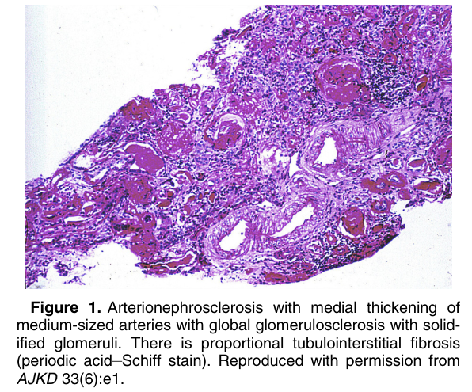
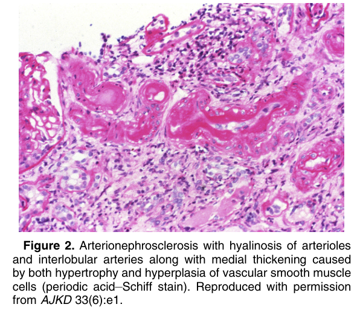
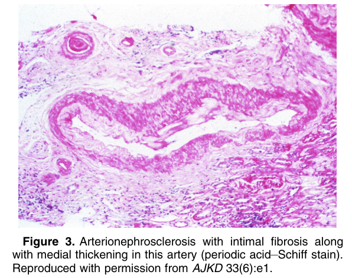
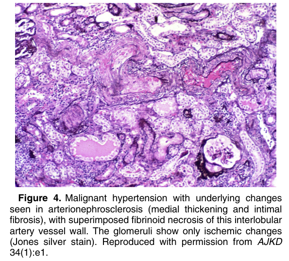
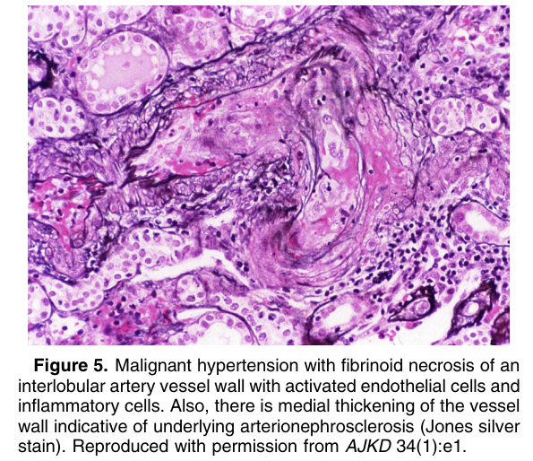
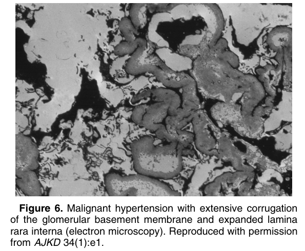

# Arterionephrosclerosis - Figures and Tables Index

This document lists all figures and tables extracted from `Arterionephrosclerosis.pdf`.

## Table of Contents
- [Figures](#figures)
- [Tables](#tables)

---

## Figures

### Fig_1

Figure 1. Arterionephrosclerosis with medial thickening of medium-sized arteries with global glomerulosclerosis with solidified glomeruli. There is proportional tubulointerstitial fibrosis (periodic acid–Schiff stain). Reproduced with permission from AJKD 33(6):e1.

---

### Fig_2

Figure 2. Arterionephrosclerosis with hyalinosis of arterioles and interlobular arteries along with medial thickening caused by both hypertrophy and hyperplasia of vascular smooth muscle cells (periodic acid–Schiff stain). Reproduced with permission from AJKD 33(6):e1.

---

### Fig_3

Figure 3. Arterionephrosclerosis with intimal fibrosis along with medial thickening in this artery (periodic acid–Schiff stain). Reproduced with permission from AJKD 33(6):e1.

---

### Fig_4

Figure 4. Malignant hypertension with underlying changes seen in arterionephrosclerosis (medial thickening and intimal fibrosis), with superimposed fibrinoid necrosis of this interlobular artery vessel wall. The glomeruli show only ischemic changes (Jones silver stain). Reproduced with permission from AJKD 34(1):e1.

---

### Fig_5

Figure 5. Malignant hypertension with fibrinoid necrosis of an interlobular artery vessel wall with activated endothelial cells and inflammatory cells. Also, there is medial thickening of the vessel wall indicative of underlying arterionephrosclerosis (Jones silver stain). Reproduced with permission from AJKD 34(1):e1.

---

### Fig_6

Figure 6. Malignant hypertension with extensive corrugation of the glomerular basement membrane and expanded lamina rara interna (electron microscopy). Reproduced with permission from AJKD 34(1):e1.

---

## Tables

*No tables resolved for this chapter.*
