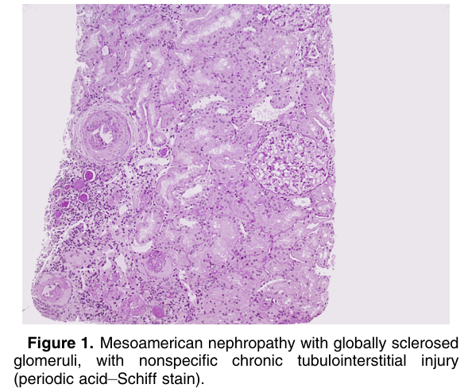
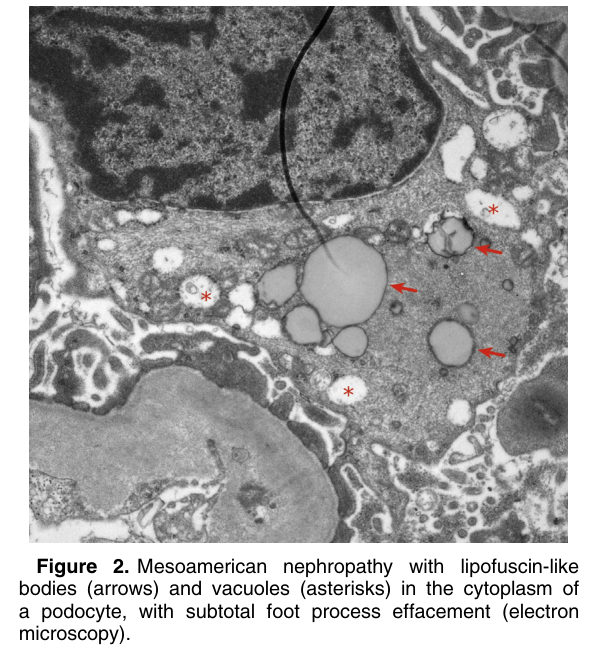

# CKD of Unknown Cause (CKDu); Mesoamerican Nephropathy - Figures and Tables Index

This document lists all figures and tables extracted from `CKD of Unknown Cause (CKDu); Mesoamerican Nephropathy.pdf`.

## Table of Contents
- [Figures](#figures)
- [Tables](#tables)

---

## Figures

### Fig_1

Figure 1. Mesoamerican nephropathy with globally sclerosed glomeruli, with nonspecific chronic tubulointerstitial injury (periodic acid–Schiff stain).

---

### Fig_2

Figure 2. Mesoamerican nephropathy with lipofuscin-like bodies (arrows) and vacuoles (asterisks) in the cytoplasm of a podocyte, with subtotal foot process effacement (electron microscopy).

---

## Tables

*No tables resolved for this chapter.*
