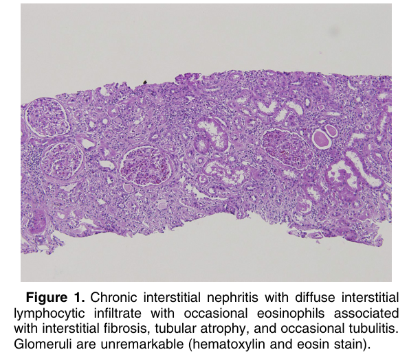
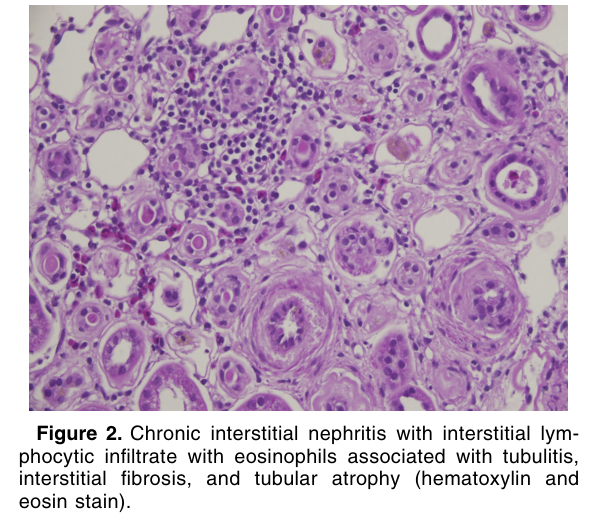
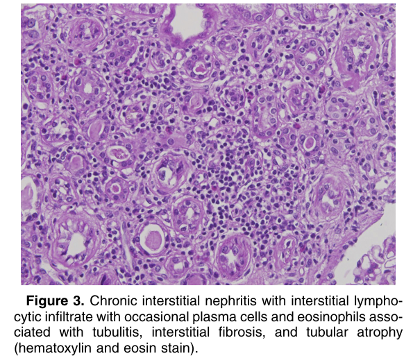

# Chronic Interstitial Nephritis - Figures and Tables Index

This document lists all figures and tables extracted from `Chronic Interstitial Nephritis.pdf`.

## Table of Contents
- [Figures](#figures)
- [Tables](#tables)

---

## Figures

### Fig_1

Figure 1. Chronic interstitial nephritis with diffuse interstitial lymphocytic infiltrate with occasional eosinophils associated with interstitial fibrosis, tubular atrophy, and occasional tubulitis. Glomeruli are unremarkable (hematoxylin and eosin stain).

---

### Fig_2

Figure 2. Chronic interstitial nephritis with interstitial lymphocytic infiltrate with eosinophils associated with tubulitis, interstitial fibrosis, and tubular atrophy (hematoxylin and eosin stain).

---

### Fig_3

Figure 3. Chronic interstitial nephritis with interstitial lymphocytic infiltrate with occasional plasma cells and eosinophils associated with tubulitis, interstitial fibrosis, and tubular atrophy (hematoxylin and eosin stain).

---

## Tables

*No tables resolved for this chapter.*
