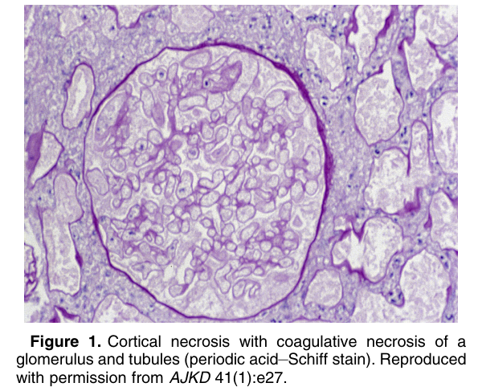
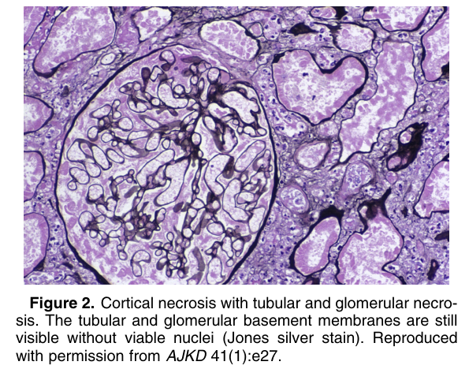
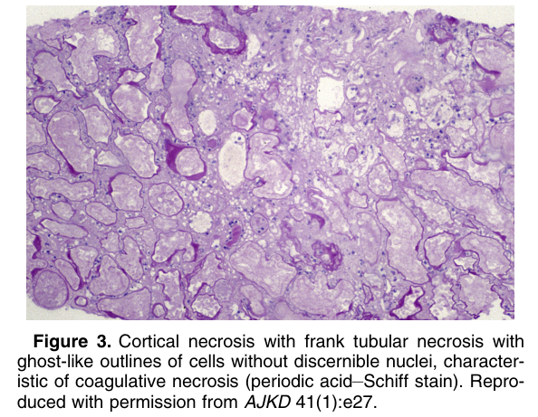
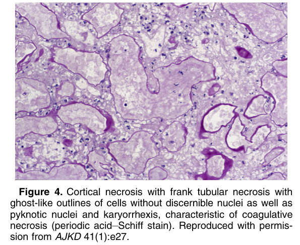

# Cortical Necrosis - Figures and Tables Index

This document lists all figures and tables extracted from `Cortical Necrosis.pdf`.

## Table of Contents
- [Figures](#figures)
- [Tables](#tables)

---

## Figures

### Fig_1

Figure 1. Cortical necrosis with coagulative necrosis of a glomerulus and tubules (periodic acid–Schiff stain). Reproduced with permission from AJKD 41(1):e27.

---

### Fig_2

Figure 2. Cortical necrosis with tubular and glomerular necrosis. The tubular and glomerular basement membranes are still visible without viable nuclei (Jones silver stain). Reproduced with permission from AJKD 41(1):e27.

---

### Fig_3

Figure 3. Cortical necrosis with frank tubular necrosis with ghost-like outlines of cells without discernible nuclei, characteristic of coagulative necrosis (periodic acid–Schiff stain). Reproduced with permission from AJKD 41(1):e27.

---

### Fig_4

Figure 4. Cortical necrosis with frank tubular necrosis with ghost-like outlines of cells without discernible nuclei as well as pyknotic nuclei and karyorrhexis, characteristic of coagulative necrosis (periodic acid–Schiff stain). Reproduced with permission from AJKD 41(1):e27.

---

## Tables

*No tables resolved for this chapter.*
