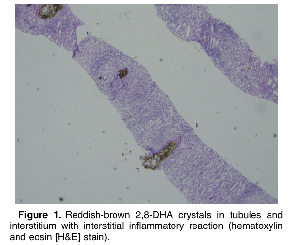
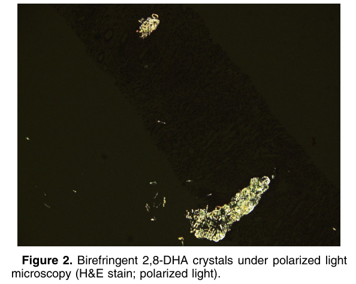

# 2,8-Dihydroxyadeninuria - Figures and Tables Index

This document lists all figures and tables extracted from `2,8-Dihydroxyadeninuria.pdf`.

## Table of Contents
- [Figures](#figures)
- [Tables](#tables)

---

## Figures

### Fig_1

Figure 1. Reddish-brown 2,8-DHA crystals in tubules and interstitium with interstitial inflammatory reaction (hematoxylin and eosin [H&E] stain).

---

### Fig_2

Figure 2. Birefringent 2,8-DHA crystals under polarized light microscopy (H&E stain; polarized light).

---

## Tables

*No tables resolved for this chapter.*
