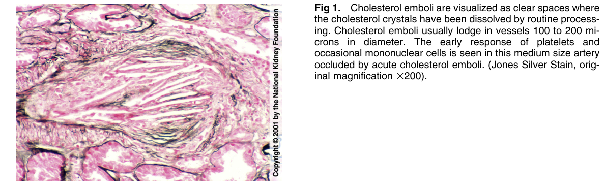
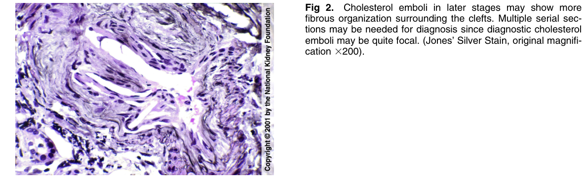

# Cholesterol Emboli 2 - Figures and Tables Index

This document lists all figures and tables extracted from `Cholesterol Emboli 2.pdf`.

## Table of Contents
- [Figures](#figures)
- [Tables](#tables)

---

## Figures

### Fig_1

Figure 1. Cholesterol emboli are visualized as clear spaces where the cholesterol crystals have been dissolved by routine processing. Cholesterol emboli usually lodge in vessels 100 to 200 microns in diameter. The early response of platelets and occasional mononuclear cells is seen in this medium size artery occluded by acute cholesterol emboli. (Jones Silver Stain, orig inal magnification 3200).

---

### Fig_2

Figure 2. Cholesterol emboli in later stages may show more fibrous organization surrounding the clefts. Multiple serial sections may be needed for diagnosis since diagnostic cholestero emboli may be quite focal. (Jones’ Silver Stain, original magnification 3200).

---

## Tables

*No tables resolved for this chapter.*
