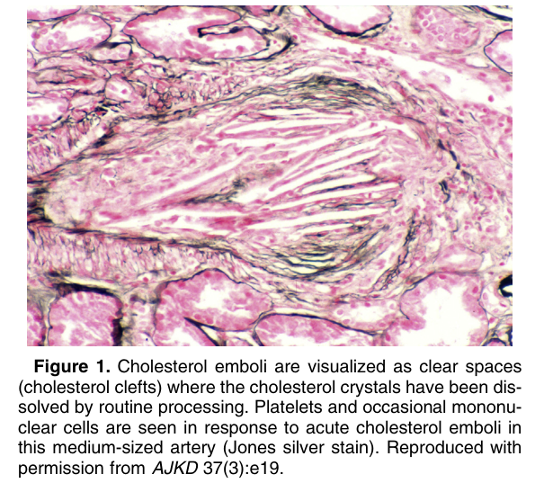
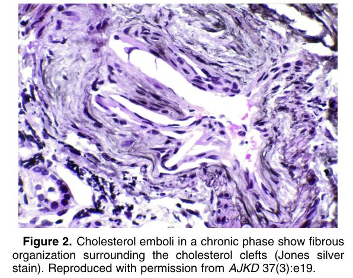
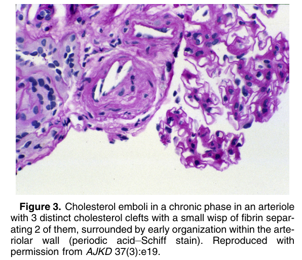
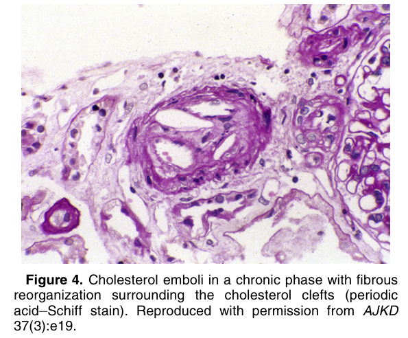
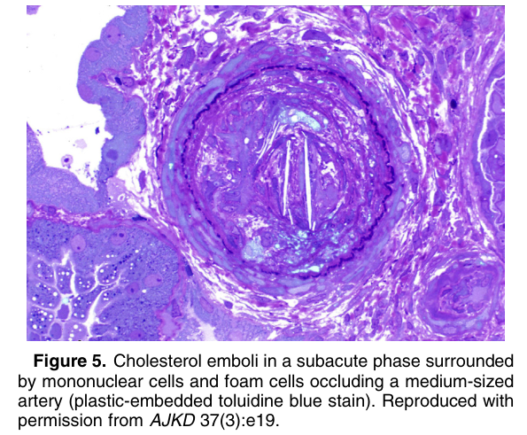

# Cholesterol Emboli - Figures and Tables Index

This document lists all figures and tables extracted from `Cholesterol Emboli.pdf`.

## Table of Contents
- [Figures](#figures)
- [Tables](#tables)

---

## Figures

### Fig_1

Figure 1. Cholesterol emboli are visualized as clear spaces (cholesterol clefts) where the cholesterol crystals have been dissolved by routine processing. Platelets and occasional mononuclear cells are seen in response to acute cholesterol emboli in this medium-sized artery (Jones silver stain). Reproduced with permission from AJKD 37(3):e19.

---

### Fig_2

Figure 2. Cholesterol emboli in a chronic phase show fibrous organization surrounding the cholesterol clefts (Jones silver stain). Reproduced with permission from AJKD 37(3):e19.

---

### Fig_3

Figure 3. Cholesterol emboli in a chronic phase in an arteriole with 3 distinct cholesterol clefts with a small wisp of fibrin separating 2 of them, surrounded by early organization within the arteriolar wall (periodic acid–Schiff stain). Reproduced with permission from AJKD 37(3):e19.

---

### Fig_4

Figure 4. Cholesterol emboli in a chronic phase with fibrous reorganization surrounding the cholesterol clefts (periodic acid–Schiff stain). Reproduced with permission from AJKD 37(3):e19.

---

### Fig_5

Figure 5. Cholesterol emboli in a subacute phase surrounded by mononuclear cells and foam cells occluding a medium-sized artery (plastic-embedded toluidine blue stain). Reproduced with permission from AJKD 37(3):e19.

---

## Tables

*No tables resolved for this chapter.*
