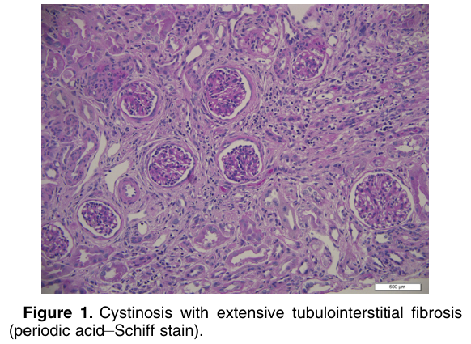
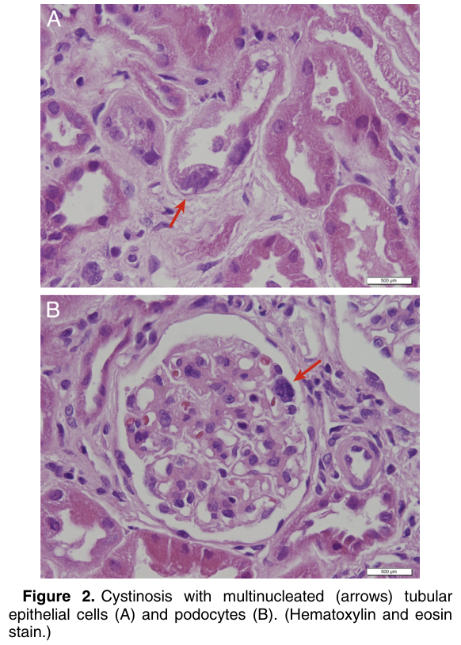
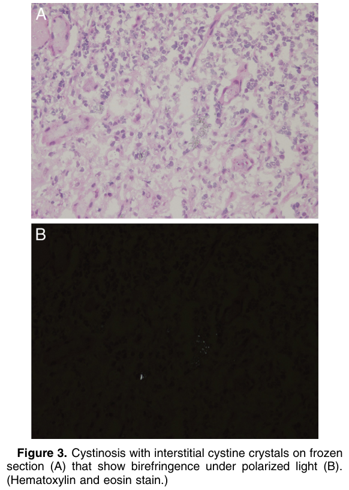
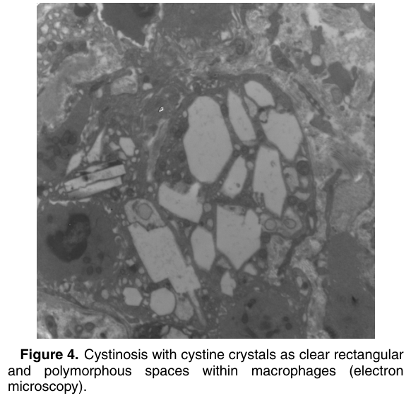

# Cystinosis - Figures and Tables Index

This document lists all figures and tables extracted from `Cystinosis.pdf`.

## Table of Contents
- [Figures](#figures)
- [Tables](#tables)

---

## Figures

### Fig_1

Figure 1. Cystinosis with extensive tubulointerstitial fibrosis (periodic acid–Schiff stain).

---

### Fig_2

Figure 2. Cystinosis with multinucleated (arrows) tubular epithelial cells (A) and podocytes (B). (Hematoxylin and eosin stain.)

---

### Fig_3

Figure 3. Cystinosis with interstitial cystine crystals on frozen section (A) that show birefringence under polarized light (B). (Hematoxylin and eosin stain.)

---

### Fig_4

Figure 4. Cystinosis with cystine crystals as clear rectangular and polymorphous spaces within macrophages (electron microscopy).

---

## Tables

*No tables resolved for this chapter.*
