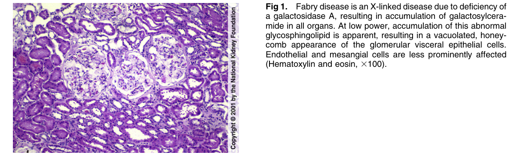
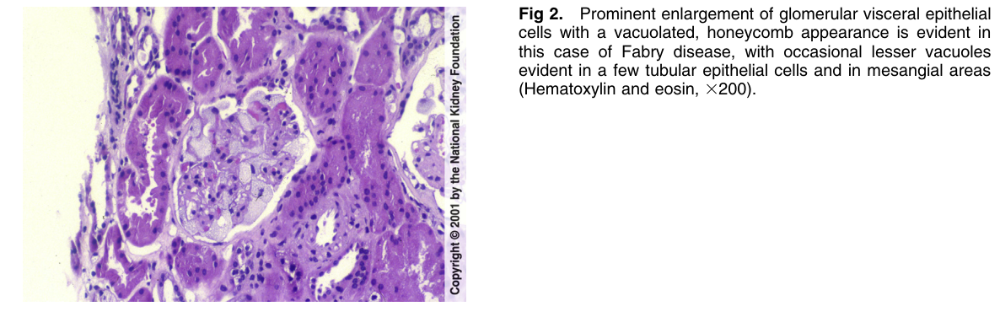
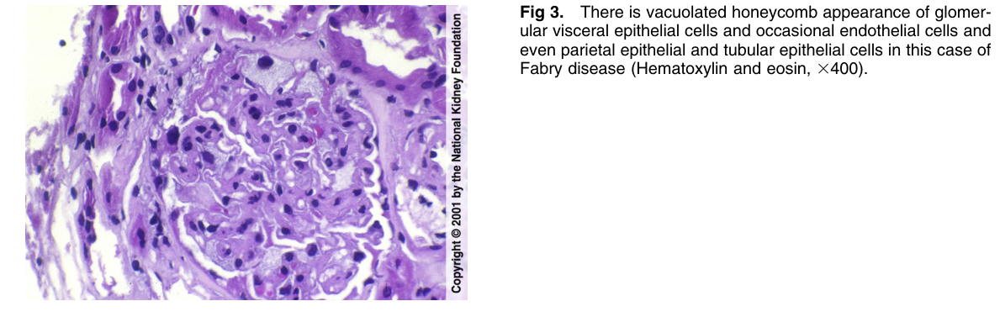
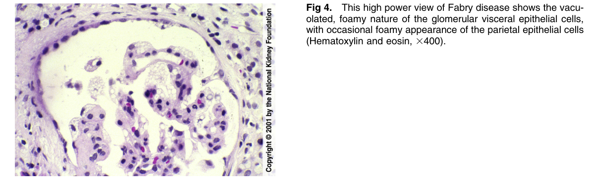
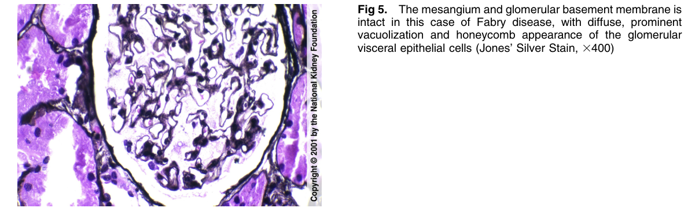
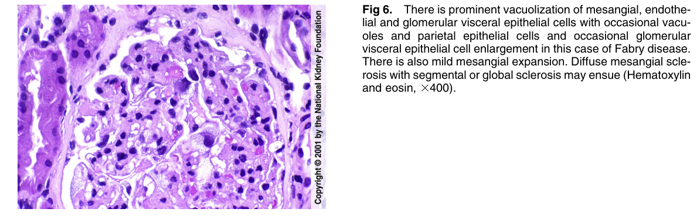
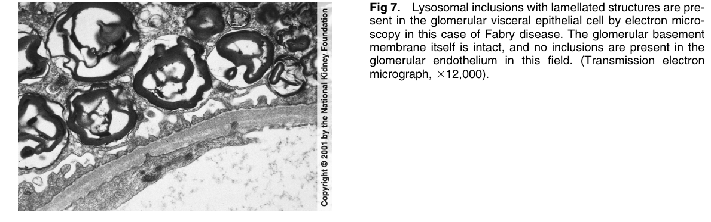
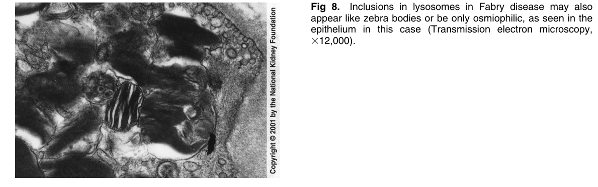
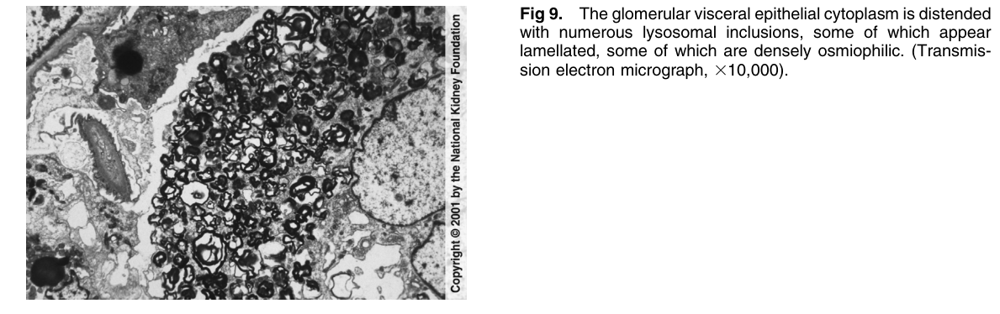

# Fabry Disease - Figures and Tables Index

This document lists all figures and tables extracted from `Fabry Disease.pdf`.

## Table of Contents
- [Figures](#figures)
- [Tables](#tables)

---

## Figures

### Fig_1

Figure 1. Fabry disease is an X-linked disease due to deficiency of a galactosidase A, resulting in accumulation of galactosylceramide in all organs. At low power, accumulation of this abnormal glycosphingolipid is apparent, resulting in a vacuolated, honeycomb appearance of the glomerular visceral epithelial cells. Endothelial and mesangial cells are less prominently affected (Hematoxylin and eosin, 3100).

---

### Fig_2

Figure 2. Prominent enlargement of glomerular visceral epithelia cells with a vacuolated, honeycomb appearance is evident in this case of Fabry disease, with occasional lesser vacuoles evident in a few tubular epithelial cells and in mesangial areas (Hematoxylin and eosin, 3200).

---

### Fig_3

Figure 3. There is vacuolated honeycomb appearance of glomerular visceral epithelial cells and occasional endothelial cells and even parietal epithelial and tubular epithelial cells in this case o Fabry disease (Hematoxylin and eosin, 3400).

---

### Fig_4

Figure 4. This high power view of Fabry disease shows the vacuolated, foamy nature of the glomerular visceral epithelial cells, with occasional foamy appearance of the parietal epithelial cell (Hematoxylin and eosin, 3400).

---

### Fig_5

Figure 5. The mesangium and glomerular basement membrane is intact in this case of Fabry disease, with diffuse, prominent vacuolization and honeycomb appearance of the glomerular visceral epithelial cells (Jones’ Silver Stain, 3400)

---

### Fig_6

Figure 6. There is prominent vacuolization of mesangial, endothelial and glomerular visceral epithelial cells with occasional vacuoles and parietal epithelial cells and occasional glomerular visceral epithelial cell enlargement in this case of Fabry disease. There is also mild mesangial expansion. Diffuse mesangial sclerosis with segmental or global sclerosis may ensue (Hematoxylin and eosin, 3400).

---

### Fig_7

Figure 7. Lysosomal inclusions with lamellated structures are present in the glomerular visceral epithelial cell by electron microscopy in this case of Fabry disease. The glomerular basement membrane itself is intact, and no inclusions are present in the glomerular endothelium in this field. (Transmission electron micrograph, 312,000).

---

### Fig_8

Figure 8. Inclusions in lysosomes in Fabry disease may also appear like zebra bodies or be only osmiophilic, as seen in the epithelium in this case (Transmission electron microscopy, 312,000).

---

### Fig_9

Figure 9. The glomerular visceral epithelial cytoplasm is distended with numerous lysosomal inclusions, some of which appear lamellated, some of which are densely osmiophilic. (Transmission electron micrograph, 310,000).

---

## Tables

*No tables resolved for this chapter.*
