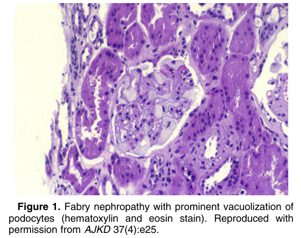
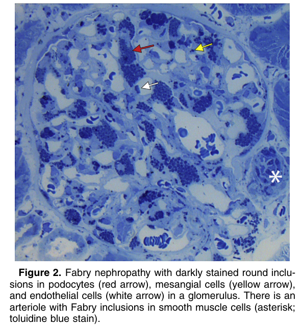
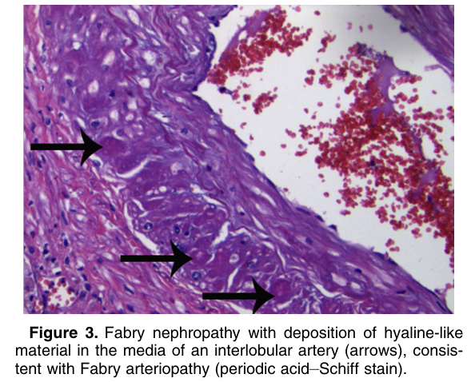
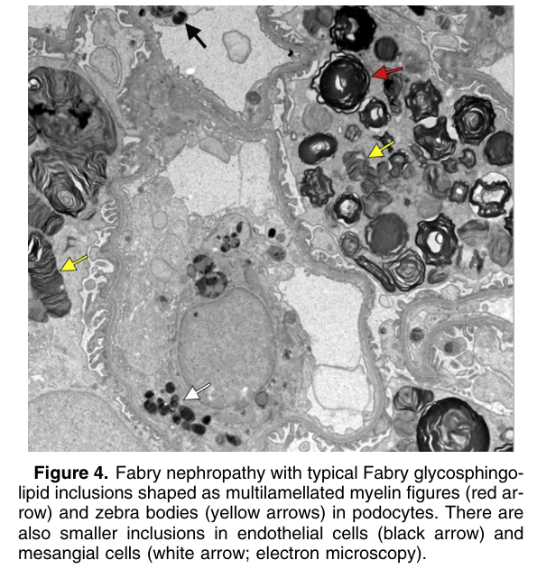

# Fabry Nephropathy - Figures and Tables Index

This document lists all figures and tables extracted from `Fabry Nephropathy.pdf`.

## Table of Contents
- [Figures](#figures)
- [Tables](#tables)

---

## Figures

### Fig_1

Figure 1. Fabry nephropathy with prominent vacuolization of podocytes (hematoxylin and eosin stain). Reproduced with permission from AJKD 37(4):e25.

---

### Fig_2

Figure 2. Fabry nephropathy with darkly stained round inclusions in podocytes (red arrow), mesangial cells (yellow arrow), and endothelial cells (white arrow) in a glomerulus. There is an arteriole with Fabry inclusions in smooth muscle cells (asterisk; toluidine blue stain).

---

### Fig_3

Figure 3. Fabry nephropathy with deposition of hyaline-like material in the media of an interlobular artery (arrows), consistent with Fabry arteriopathy (periodic acid–Schiff stain).

---

### Fig_4

Figure 4. Fabry nephropathy with typical Fabry glycosphingo lipid inclusions shaped as multilamellated myelin figures (red arrow) and zebra bodies (yellow arrows) in podocytes. There are also smaller inclusions in endothelial cells (black arrow) and mesangial cells (white arrow; electron microscopy).

---

## Tables

*No tables resolved for this chapter.*
