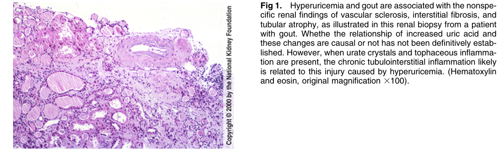
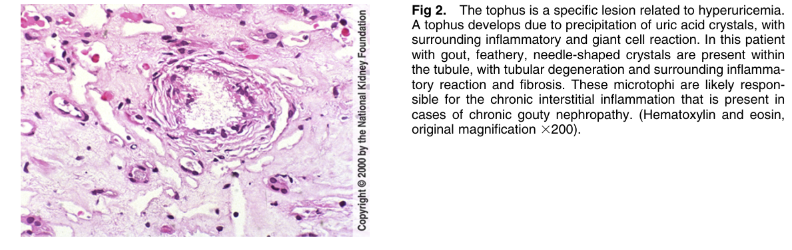

# Gouty Nephropathy 2 - Figures and Tables Index

This document lists all figures and tables extracted from `Gouty Nephropathy 2.pdf`.

## Table of Contents
- [Figures](#figures)
- [Tables](#tables)

---

## Figures

### Fig_1

Figure 1. Hyperuricemia and gout are associated with the nonspecific renal findings of vascular sclerosis, interstitial fibrosis, and tubular atrophy, as illustrated in this renal biopsy from a patient with gout. Whethe the relationship of increased uric acid and these changes are causal or not has not been definitively established. However, when urate crystals and tophaceous inflammation are present, the chronic tubulointerstitial inflammation likel is related to this injury caused by hyperuricemia. (Hematoxylin and eosin, original magnification 3100).

---

### Fig_2

Figure 2. The tophus is a specific lesion related to hyperuricemia. A tophus develops due to precipitation of uric acid crystals, with surrounding inflammatory and giant cell reaction. In this patien with gout, feathery, needle-shaped crystals are present within the tubule, with tubular degeneration and surrounding inflammatory reaction and fibrosis. These microtophi are likely responsible for the chronic interstitial inflammation that is present in cases of chronic gouty nephropathy. (Hematoxylin and eosin, original magnification 3200).

---

## Tables

*No tables resolved for this chapter.*
