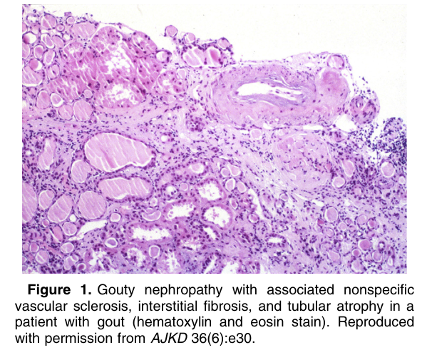
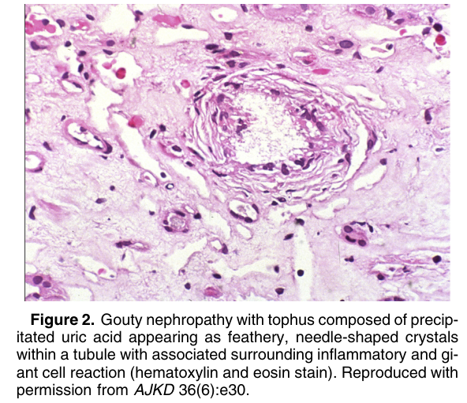
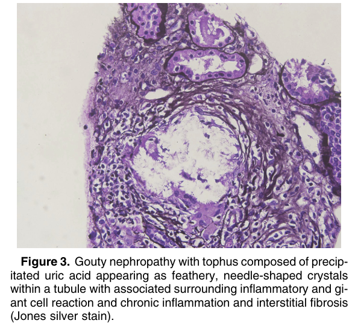

# Gouty Nephropathy - Figures and Tables Index

This document lists all figures and tables extracted from `Gouty Nephropathy.pdf`.

## Table of Contents
- [Figures](#figures)
- [Tables](#tables)

---

## Figures

### Fig_1

Figure 1. Gouty nephropathy with associated nonspecific vascular sclerosis, interstitial fibrosis, and tubular atrophy in a patient with gout (hematoxylin and eosin stain). Reproduced with permission from AJKD 36(6):e30.

---

### Fig_2

Figure 2. Gouty nephropathy with tophus composed of precipitated uric acid appearing as feathery, needle-shaped crystals within a tubule with associated surrounding inflammatory and giant cell reaction (hematoxylin and eosin stain). Reproduced with permission from AJKD 36(6):e30.

---

### Fig_3

Figure 3. Gouty nephropathy with tophus composed of precipitated uric acid appearing as feathery, needle-shaped crystals within a tubule with associated surrounding inflammatory and giant cell reaction and chronic inflammation and interstitial fibrosis (Jones silver stain).

---

## Tables

*No tables resolved for this chapter.*
