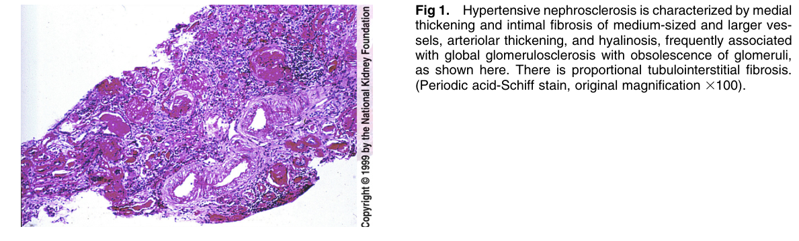
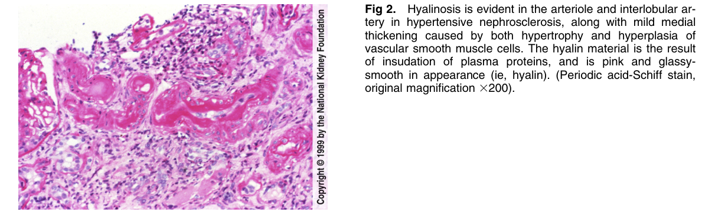

# Hypertensive Nephrosclerosis - Figures and Tables Index

This document lists all figures and tables extracted from `Hypertensive Nephrosclerosis.pdf`.

## Table of Contents
- [Figures](#figures)
- [Tables](#tables)

---

## Figures

### Fig_1

Figure 1. Hypertensive nephrosclerosis is characterized by media thickening and intimal fibrosis of medium-sized and larger vessels, arteriolar thickening, and hyalinosis, frequently associated with global glomerulosclerosis with obsolescence of glomeruli, as shown here. There is proportional tubulointerstitial fibrosis. (Periodic acid-Schiff stain, original magnification 3100).

---

### Fig_2

Figure 2. Hyalinosis is evident in the arteriole and interlobular artery in hypertensive nephrosclerosis, along with mild media thickening caused by both hypertrophy and hyperplasia of vascular smooth muscle cells. The hyalin material is the resul of insudation of plasma proteins, and is pink and glassysmooth in appearance (ie, hyalin). (Periodic acid-Schiff stain, original magnification 3200).

---

## Tables

*No tables resolved for this chapter.*
