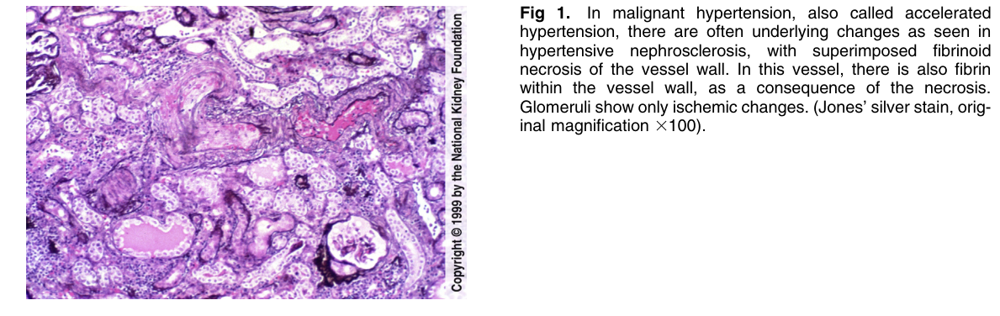
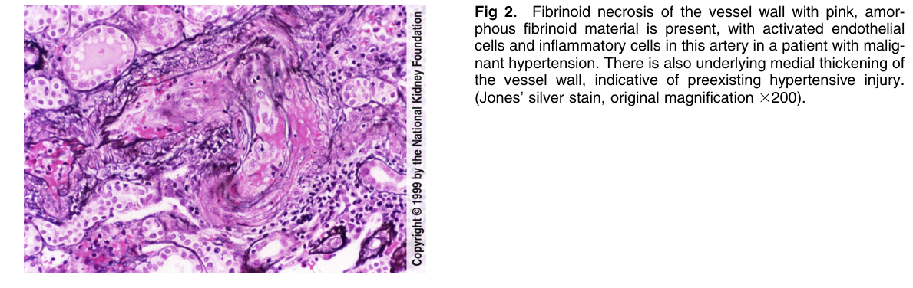

# Malignant Hypertension - Figures and Tables Index

This document lists all figures and tables extracted from `Malignant Hypertension.pdf`.

## Table of Contents
- [Figures](#figures)
- [Tables](#tables)

---

## Figures

### Fig_1

Figure 1. In malignant hypertension, also called accelerated hypertension, there are often underlying changes as seen in hypertensive nephrosclerosis, with superimposed fibrinoid necrosis of the vessel wall. In this vessel, there is also fibrin within the vessel wall, as a consequence of the necrosis. Glomeruli show only ischemic changes. (Jones’ silver stain, orig inal magnification 3100).

---

### Fig_2

Figure 2. Fibrinoid necrosis of the vessel wall with pink, amorphous fibrinoid material is present, with activated endothelia cells and inflammatory cells in this artery in a patient with malignant hypertension. There is also underlying medial thickening of the vessel wall, indicative of preexisting hypertensive injury. (Jones’ silver stain, original magnification 3200).

---

## Tables

*No tables resolved for this chapter.*
